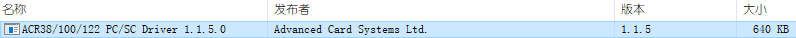
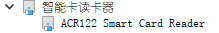
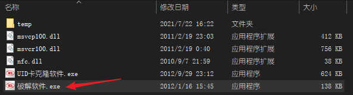
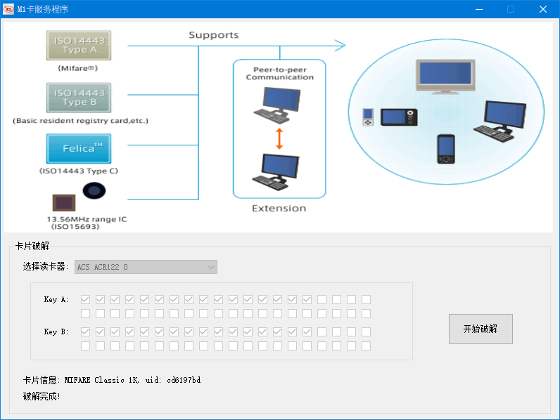
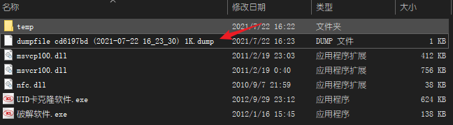
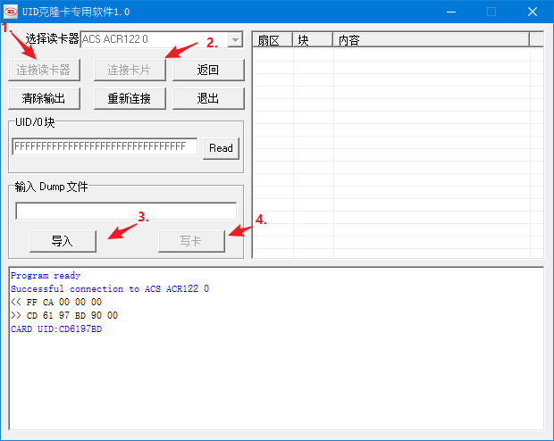
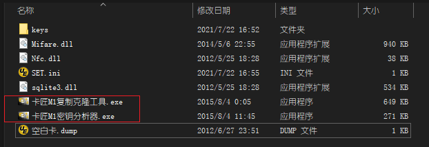
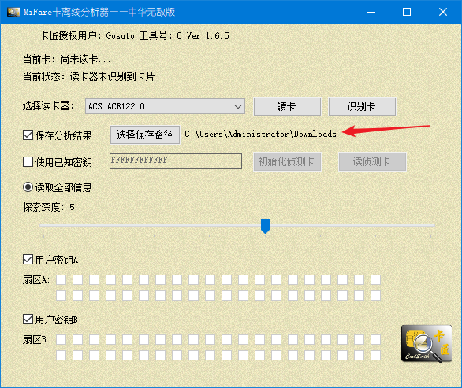
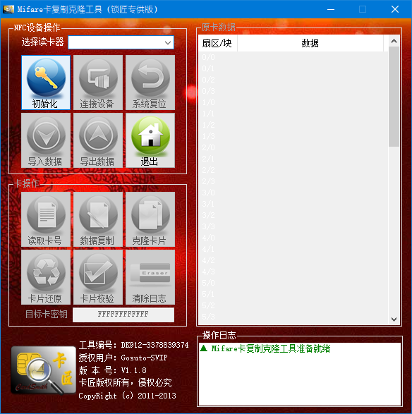

## 安装驱动

安装驱动版本ACR122U[驱动V1.1.5](https://wwr.lanzoui.com/iZ0Gbrq406d)



安装完后把读卡器拔掉重连，计算机管理 -》设备管理 中出现读卡器型号即为成功。



## UID克隆工具破解IC卡



### 破解并导出dump

把卡放上去，点击开始破解，出现破解完成即可。



破解成功之后，卡的dump数据就已经被导出了。



### dump导入白卡

打开UID卡克隆软件.exe



连接读卡器 -> 连接卡片 -> 导入文件(选择刚才破解时导出的dump) -> 点击写卡，即可把数据写入其中。

## 卡匠破解IC卡



### 破解并导出dump

打开卡匠M1密钥分析器.exe，破解秘钥并导出，一定要选择保存路径，将导出的dump数据放在指定的文件夹下面。



### dump导入白卡

打开卡匠M1复制克隆工具.exe，将数据导出到白卡上。



### 功能

#### 数据复制(普通卡)

写入除了UID（0号块）之外的63个块的数据。

#### 克隆卡片(特种IC卡)

卡片克隆用于完全克隆IC卡（带UID也一起克隆），需要可改写UID的特种IC卡。

```
1. 点击“克隆卡片”按钮，IC卡读写器红灯开始闪烁，开始克隆卡片； 
2. 当IC卡读写器绿灯亮起时，说明克隆过程结束，此时查看操作日志，如无错误则说明克隆操作成功。
```

克隆卡操作与复制卡操作的区别在于：

1、使用的卡片不同：复制卡使用新的普通的IC卡，克隆卡使用可改写UID的特种IC卡。

2、结果不同：复制卡是将除0扇区0块以外的数据，全部写入新的普
通的IC卡中，得到一张与原卡数据相同，但UID号不同的卡。而克隆卡是连同0扇区0块的数据在内，全部写入可改写UID的特种IC卡中，得到一张与原卡完全一样的（包括UID号）卡。

#### 卡片还原(普通卡)

此功能仅对普通IC卡有效，请勿对可改写UID的特种卡使
用本功能！此功能用于将已经写入数据的卡中数据清空，并将所有扇区密码改成12个F。使用此功能时，按照以下步骤操作： 

```
1. 使用Mifare密钥分析器软件，对需要清空数据的卡进行数据分析； 
2. 将分析得到的数据文件导入到Mifare卡复制克隆工具中；
3. 点击“卡片还原”按钮，当IC卡读写器绿灯亮起时，说明还原过程结束，此时查看操作日志，如无错误则说明操作成功； 
4. 如需要验证卡内数据是否被清空，可以导入“空白卡.dump”，然后点击“卡片校检”，予以验证。
```

#### 卡片校验

卡片校检：此功能用于验证卡中数据与“原卡数据”区内的数据是否相符。

