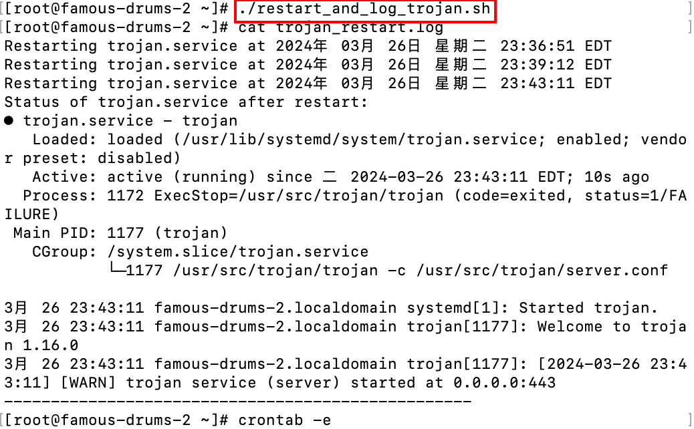

## 创建脚本

```bash
vi restart_and_log_trojan.sh
chmod +x restart_trojan_service.sh
```

内容如下

```bash
#!/bin/bash
# 定义日志文件的路径
LOG_FILE="$HOME/trojan_restart.log"

# 检查日志文件是否存在，如果不存在，则创建它
if [ ! -f "$LOG_FILE" ]; then
    touch "$LOG_FILE"
fi

# 记录重启服务的时间
echo "Restarting trojan.service at $(date)" >> "$LOG_FILE"

# 重启 trojan.service 服务
sudo systemctl restart trojan.service

# 增加延迟以确保服务有足够的时间重启
sleep 10

# 记录服务状态
echo "Status of trojan.service after restart:" >> "$LOG_FILE"
sudo systemctl status trojan.service >> "$LOG_FILE" 2>&1
echo "--------------------------------------------------" >> "$LOG_FILE"

```



## 定时任务

```bash
crontab -e
```

在 `crontab` 文件中添加以下行以安排任务（假设在每周日和周四的晚上 11 点执行）：

```bash
0 23 * * 0,4 ~/restart_trojan_service.sh
```

