## 购买服务器

随便买一个带云服务器

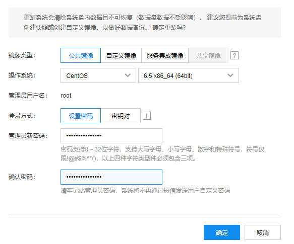

安装好环境，这里使用CentOS6.5

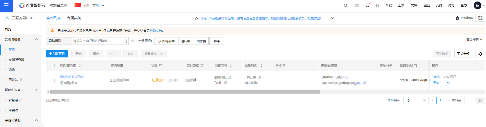

## 部署服务端

### 上传文件

把dof和dof.tar.gz(这个文件会把很多系统文件覆盖)两个文件传到根目录/下面

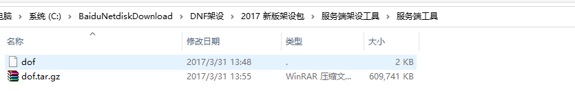

### 安装服务端

```bash
cd /
chmod 777 dof
./dof
```

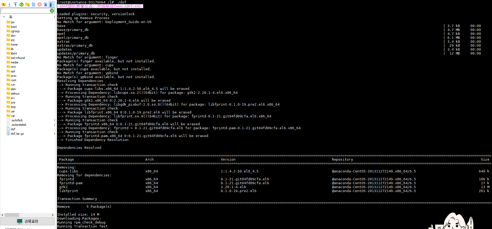

搭建完成，可以看的出来用的是xampp(Apache + MySQL + PHP + Perl)环境，安装完成后会自动重启。


### 修改配置文件

进入/home/neople/game/cfg下面，找到cain01...cain05，更改这5个文件里面的IP配置。因为每个文件要改8处IP，要改5个文件，所以推荐下载下来改完后再上传覆盖。

```bash
cd /home/neople/game/cfg
```

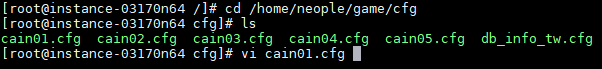

```bash
vi cain01.cfg
```

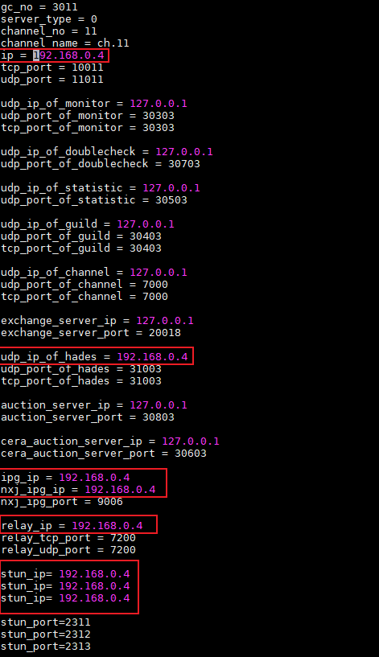

### 运行服务端

更改配置后，进入到~目录下，运行服务端.

```bash
./run  #服务端程序开始运行
```

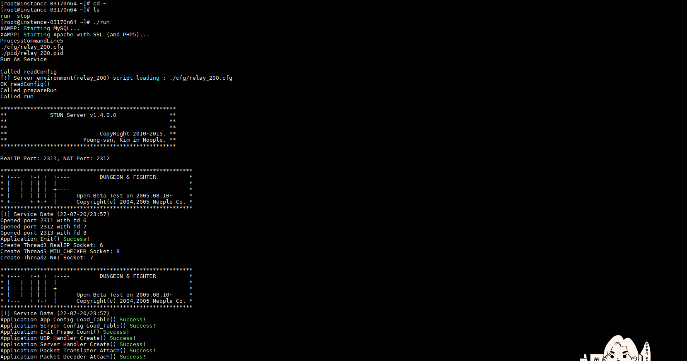

服务端程序开始运行。

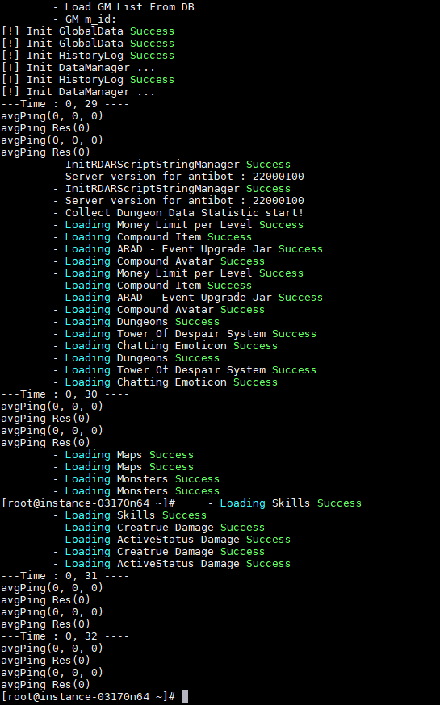

要等很久很久才能出现五个编码，等了近二十分钟。

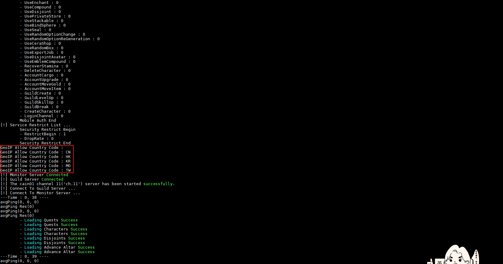

## 客户端

### 解压客户端

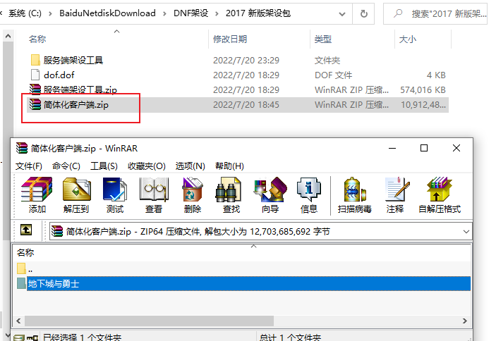

解压客户端后如下

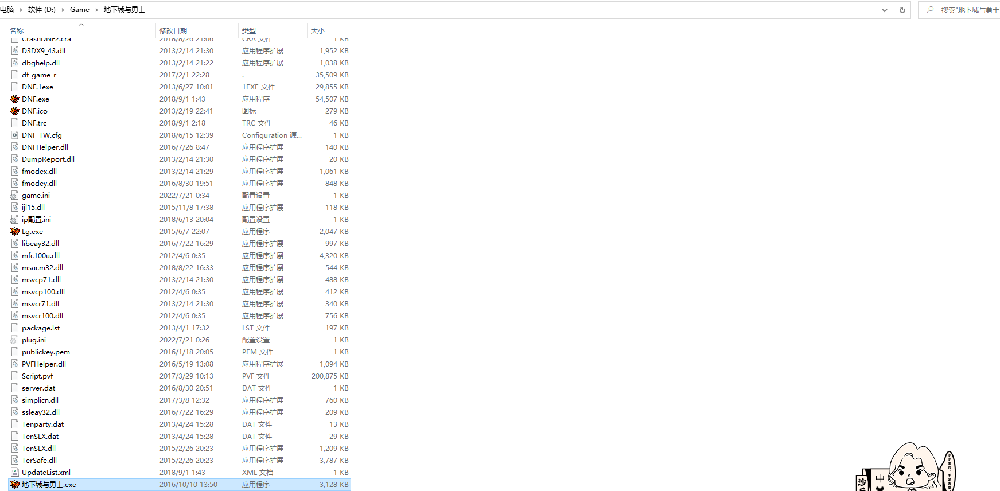

### Win10补丁

然后解压win10补丁覆盖到客户端目录下面，不然win10下面不能玩。

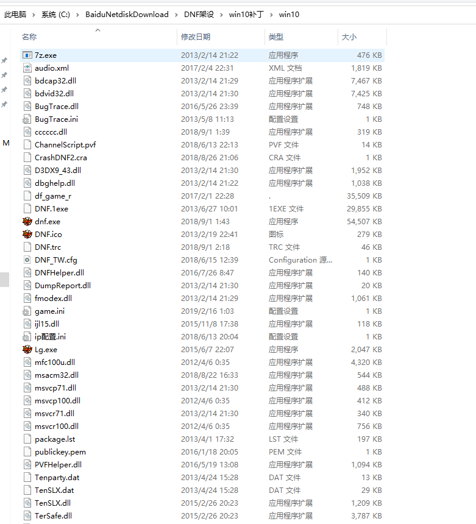

### 修改game.ini

把Server和DBIP改为公网IP即可.

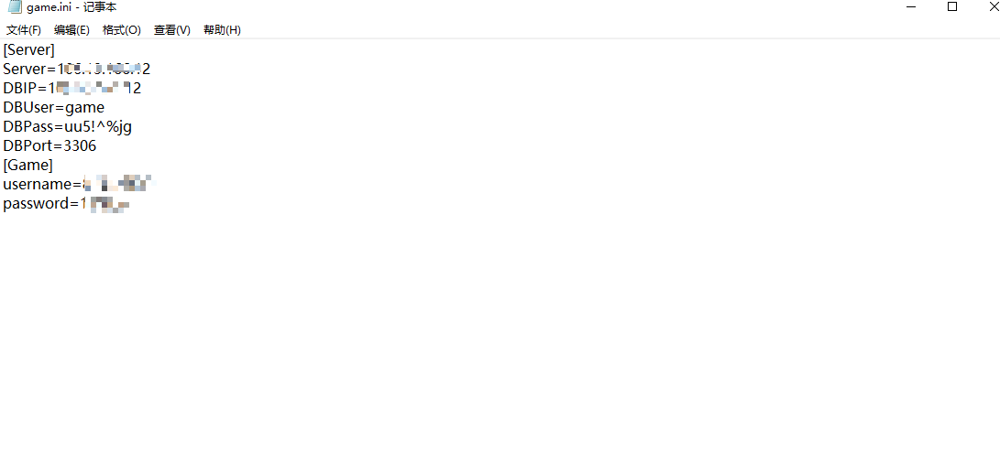

### 启动游戏

点击地下城与勇士.exe启动游戏，点击左上角可以先注册账号。

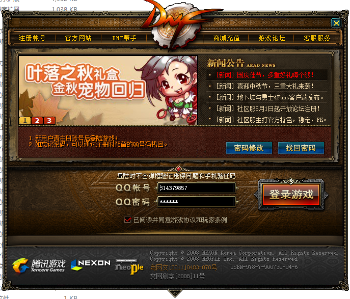

### 进入游戏

服务器列表为空，点击变更伺服器。

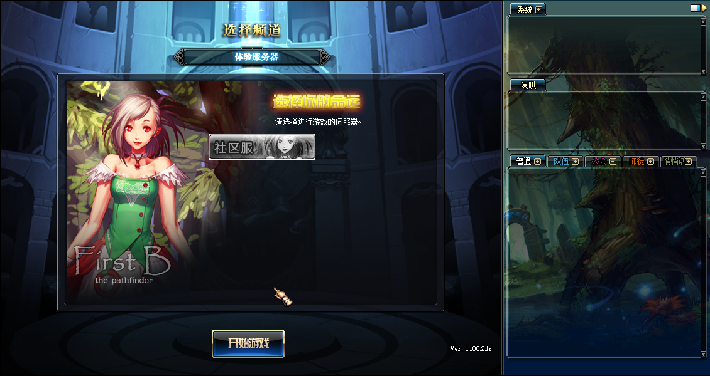

社区服为灰色，连续输入两次./stop，再输入一次./run，出现五国就可以了。

## 服务器更新

一共需要两个文件，一个是Script.pvf，一个是黑岩客户端文件。
1）先把黑岩客户端文件解压覆盖到原来客户端的文件里面，把Script.pvf也覆盖到客户端文件里。
2）把Script.pvf文件上传到服务端/home/neople/game下面。连上服务器，连续输入两次./stop，关闭服务器程序，再./run将启动服务。