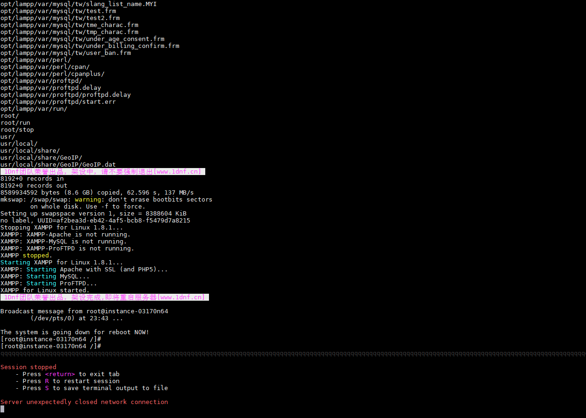
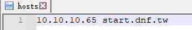
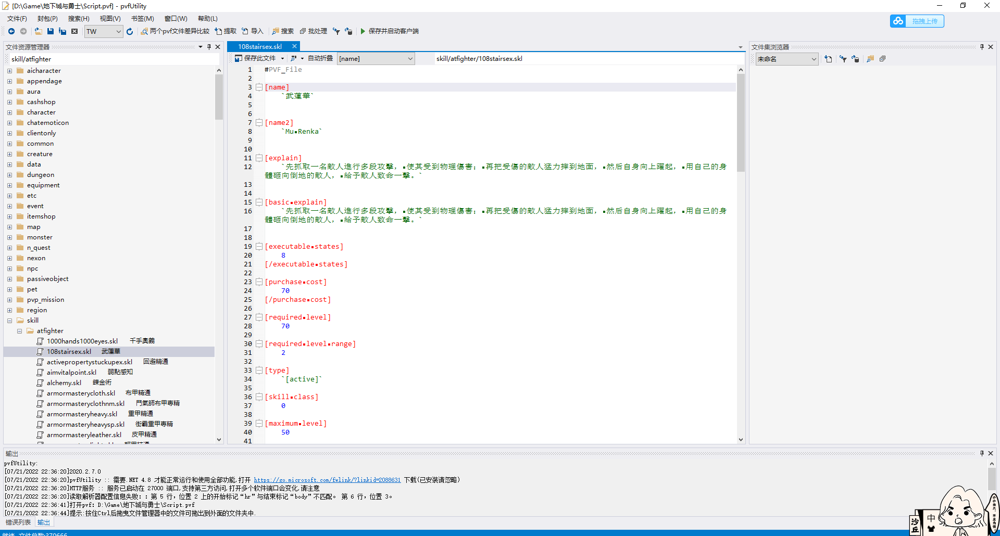

## 购买服务器

随便买一个带云服务器


安装好环境，这里使用CentOS6.5


## 部署服务端

### 上传文件

把dof和dof.tar.gz(这个文件会把很多系统文件覆盖)两个文件传到根目录/下面


### 安装服务端

```bash
cd /
chmod 777 dof
./dof
```


搭建完成，可以看的出来用的是xampp(Apache + MySQL + PHP + Perl)环境，安装完成后会自动重启。



### 修改配置文件

进入/home/neople/game/cfg下面，找到cain01...cain05，更改这5个文件里面的IP配置。因为每个文件要改8处IP，要改5个文件，所以推荐下载下来改完后再上传覆盖。

```bash
cd /home/neople/game/cfg
```


```bash
vi cain01.cfg
```


### 运行服务端

更改配置后，进入到~目录下，运行服务端.

```bash
./run  #服务端程序开始运行
```


服务端程序开始运行。


要等很久很久才能出现五个编码，等了近二十分钟（可能是因为1核1G的服务器不行）。


## 客户端

### 解压客户端


解压客户端后如下


### Win10补丁

然后解压win10补丁覆盖到客户端目录下面，不然win10下面不能玩。


### 修改game.ini

把Server和DBIP改为公网IP即可.


### 启动游戏

点击地下城与勇士.exe启动游戏，点击左上角可以先注册账号。


### 进入游戏

服务器列表为空，点击变更伺服器。


社区服为灰色，连续输入两次./stop，再输入一次./run，出现五国就可以了（我的服务器配置很低，出现五国也依然可能是灰色，咋搞都是灰色，但是隔了一天又可以了，后来发现这根本不是服务器的问题）。

## 服务器灰色原因

服务器灰色原因网上解决办法有重启服务的各种操作，后来用了wireshark抓包看了一下，发现并不是这个原因。

### 问题发现

起初在百度云BBC服务器上搭建了一个私服，当天服务器一直是灰色的，第二天再次登录就正常了，网上都说是服务器问题（后经抓包发现是客户端问题）。

第三天又在VMware中搭建一个局域网的服务器，改掉game.ini为虚拟机内网ip。

从注册账号这里开始出现神奇的事情了，注册了一个和BBC服务器一模一样的账号密码，登录进去后，发现里面居然有在BBC服务器创建的人物。然后再创建一个新的账号（BBC服务器中不存在的账号），发现可以登录，但是在选择服务器时提示：**因伺服器频道资料传输异常已断线。请稍后重行登入。**这就说明登录走的是game.ini的配置（mysql配置），而拉取服务器时并没有使用Server配置的IP，而是使用了某个电脑中初始化的配置。

于是删除电脑中DNF的一些配置及缓存文件

```
C:\Users\administrator\AppData\LocalLow\DNF
```

发现依然不可以使用。

最后发现，居然是在host文件中配置域名解析的IP地址。

```
notepad C:\Windows\System32\drivers\etc\hosts
```

把host文件中域名解析的IP地址改为内网IP即可。




## 服务器更新

一共需要两个文件，一个是Script.pvf，一个是黑岩客户端文件。
1）先把黑岩客户端文件解压覆盖到原来客户端的文件里面，把Script.pvf也覆盖到客户端文件里。
2）把Script.pvf文件上传到服务端/home/neople/game下面。连上服务器，连续输入两次./stop，关闭服务器程序，再./run将启动服务。

### 更改pvf文件

pvf中就是dnf的所有数据，可以用pvfUtility进行修改。

