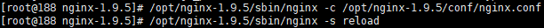

## 安装Nginx和nginx-rtmp-module

### 安装make等命令

```bash
yum -y install gcc automake autoconf libtool make
yum install wget
yum install unzip
```

### 下载nginx-rtmp-module

```bash
mkdir ~/module     # 创建下载module的文件夹
cd ~/module
wget https://github.com/arut/nginx-rtmp-module/archive/master.zip        # 下载模块
unzip master.zip      # 解压
```

### 安装nginx

```bash
cd /
yum -y install pcre-devel openssl openssl-devel  #安装依赖包
wget http://nginx.org/download/nginx-1.12.2.tar.gz   #下载nginx包
tar -zxvf nginx-1.12.2.tar.gz
cd nginx-1.12.2
./configure --prefix=/opt/nginx-1.12.2 --with-http_stub_status_module --add-module=/root/module/nginx-rtmp-module-master --with-http_ssl_module    #--prefix=/opt/nginx-1.12.2为安装位置
make
make install
```

## 修改nginx配置

### rtsp转rtmp配置

vi /opt/nginx-1.12.2/conf/nginx.conf

```bash
rtmp {
   # 转流服务,可以存在多个,每个服务端口要不同
   server {
     listen 1935;
     application myapp{    #应用名,可以存在多个
        live on;
        record off;
        allow play all;
     }
   }
}
```


rtmp协议和http协议是同为应用层的不同协议，rtmp配置需要写在http外面同级。

### rtsp转hls配置

在http配置中添加如下，直接把m3u8和切片文件放入nginx/hls文件夹下即可。

```bash
server {
  listen       8002;
  server_name  server_hls;

  location / {
    types {
       application/vnd.apple.mpegusr m3u8;
       video/mp2t ts;
    }
    root hls;    #8002端口服务的根目录,nginx目录下的hls目录
    add_header Cache-Control no-cache;
    add_header Access-Control-Allow-Origin *;
    add_header Access-Control-Allow-Headers "Origin, X-Requested-With,      Content-Type, Accept";
    add_header Access-Control-Methods "GET, POST, OPTIONS";
  }
}
```


### 重新载入nginx

```bash
/opt/nginx-1.9.5/sbin/nginx -s reload
```

出现如下问题,没有nginx.pid
nginx: [error] open() "/opt/nginx-1.12.2/logs/nginx.pid" failed (2: No such file or directory)

```bash
/opt/nginx-1.9.5/sbin/nginx -c /opt/nginx-1.9.5/conf/nginx.conf
```



### 启动nginx

```bash
/opt/nginx-1.9.5/sbin/nginx
/opt/nginx-1.9.5/sbin/nginx -s stop
```


## 安装FFmpeg

```bash
yum install yasm -y   #安装依赖,自动不行就手动
cd /opt
git clone https://git.ffmpeg.org/ffmpeg.git ffmpeg  #下载ffmpeg
cd ffmpeg
./configure --prefix=/usr/local/ffmpeg
make
make install
```

### 手动安装依赖yasm

```bash
wget http://www.tortall.net/projects/yasm/releases/yasm-1.3.0.tar.gz
tar zxvf yasm-1.3.0.tar.gz
cd yasm-1.3.0
./configure
make && make install
```

### 拷贝命令到/usr/bin

```bash
ls /usr/local/ffmpeg/
bin    include    lib    share
cp /usr/local/ffmpeg/bin/*   /usr/bin/
```


## 测试

### RTSP转RTMP

rtsp地址为源地址，rtmp后面为Nginx视频服务器的ip+Nginx配置的1935端口/application名/视频名

```
ffmpeg -rtsp_transport tcp  -i rtsp://wowzaec2demo.streamlock.net/vod/mp4:BigBuckBunny_115k.mov -acodec aac -strict experimental -ar 44100 -ac 2 -b:a 96k -r 25 -b:v 500k -s 640*480 -f flv rtmp://222.222.221.188:1935/myapp/23
```


在vlc中打开转换后的rtmp地址
rtmp://222.222.221.188:1935/myapp/23


### RTSP转HLS

HLS (HTTP Live Streaming)是Apple的动态码率自适应技术。主要用于PC和Apple终端的音视频服务。包括一个m3u(8)的索引文件，TS媒体分片文件和key加密串文件。
在上文nginx中/hls的root部分配置了html路径，对应nginx目录下的html文件夹，用于存储m3u8文件及ts文件
此时ffmpeg的命令使用,将在nginx/hls文件夹生成test.m3u8文及切片视频。

```
ffmpeg -f rtsp -rtsp_transport tcp -i rtsp://wowzaec2demo.streamlock.net/vod/mp4:BigBuckBunny_115k.mov -codec copy -f hls -hls_list_size 10 -hls_wrap 20 -hls_time 15  /opt/nginx-1.9.5/hls/test.m3u8
```


vlc中输入http://222.222.221.188:8002/test.m3u8
vlc不播放时，在浏览器输入地址看看是否可以直接下载m3u8文件，如果不能下载检查nginx根目录下hls文件夹内是否生成文件,如果已经生成检查conf/nginx.conf配置文件是否配置正确。

