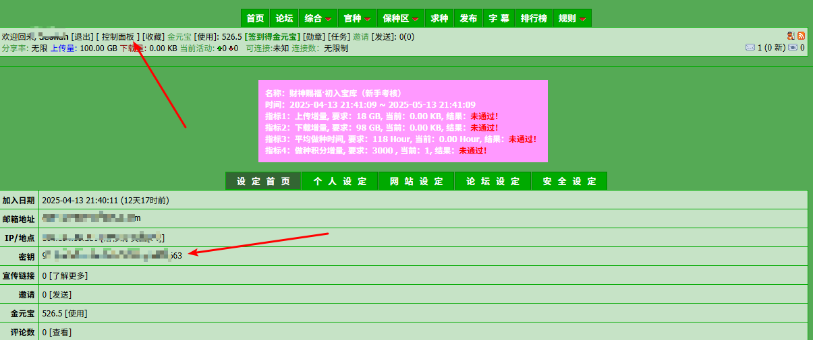
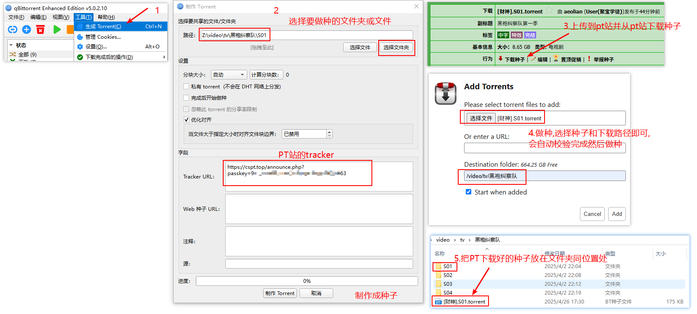

## 注册PT站账号


| 序号 | 名称 | 网址 | 类型 | 特色说明 |
| :--: | :-- | :--- | :-- | :-- |
| 1 | The Pirate Bay | [https://thepiratebay.org](https://thepiratebay.org) | 综合资源 | 世界最老牌之一，资源全面，少量中文 |
| 2 | RARBG | [https://rarbg.to](https://rarbg.to) | 综合资源 | 电影、剧集质量高，字幕资源丰富（部分支持中文） |
| 3 | YTS | [https://yts.mx](https://yts.mx) | 电影专用 | 小体积高清电影，部分电影自带中英双语字幕 |
| 4 | 1337X | [https://1337x.to](https://1337x.to) | 综合资源 | 动漫区、剧集区资源丰富，部分中文种子 |
| 5 | Rutracker | [https://rutracker.org](https://rutracker.org) | 综合资源 | 俄语站但资源海量，含大量音乐、软件和中文漫画 |
| 6 | LimeTorrents | [https://limetorrents.info](https://limetorrents.info) | 综合资源 | 更新迅速，部分冷门中文资源可挖掘 |
| 7 | EZTV | [https://eztv.re](https://eztv.re) | 电视剧专用 | 主打欧美剧，需搭配字幕组资源 |
| 8 | TorrentDownloads | [https://www.torrentdownloads.me?ref=codernav.com](https://www.torrentdownloads.me?ref=codernav.com) | 综合资源 | 适合找冷门、旧版中文软件资源 |
| 9 | IPTorrents | [https://www.iptorrents.com?ref=codernav.com](https://www.iptorrents.com?ref=codernav.com) | 综合资源 | 会员制，速度快，有中文剧集区 |
| 10 | Bibliotik | [https://bibliotik.org](https://bibliotik.org) | 电子书专用 | 高质量电子书，少量中文电子书资源 |
| 11 | Nyaa | [https://nyaa.si?ref=codernav.com](https://nyaa.si?ref=codernav.com) | 动漫资源 | 超大量日漫、港漫、中文汉化资源 |
| 12 | Torrent9 | [https://www.torrent9.vip](https://www.torrent9.vip) | 综合资源 | 法语站，适合搜少见的欧美电影 |
| 13 | FitGirl Repacks | [https://fitgirl-repacks.site?ref=codernav.com](https://fitgirl-repacks.site?ref=codernav.com) | 游戏专用 | 极致压缩的PC大作，部分支持简中安装包 |
| 14 | Zooqle | [https://zooqle.com](https://zooqle.com) | 综合资源 | 支持多条件筛选，可精准找中文字幕电影 |
| 15 | Magnetdl | [https://magnetdl.com?ref=codernav.com](https://magnetdl.com?ref=codernav.com) | 磁力链接 | 纯磁力站，便于高速下载 |
| 16 | Arenabg | [https://arenabg.com](https://arenabg.com) | 综合资源 | 保加利亚站，资源更新稳定 |
| 17 | Torlock | [https://torlock.com](https://torlock.com) | 综合资源 | 500万真实种子验证，部分中文电影 |
| 18 | Pcgamestorrents | [https://pcgamestorrents.com?ref=codernav.com](https://pcgamestorrents.com?ref=codernav.com) | 游戏专用 | PC单机游戏丰富，有部分繁中版资源 |
| 19 | Torrentgalaxy | [https://torrentgalaxy.to](https://torrentgalaxy.to) | 综合资源 | 新兴站点，用户活跃，有中文电影区 |


1. **选择PT站**

    选择你想注册的PT站点（例如：PTHub、BTSky等）。每个PT站可能有不同的注册方式，通常PT站都是私密的，需要通过邀请码或申请来获得账号。


1. **注册流程**

   - 访问目标PT站的官网。

   - 点击“注册”或“申请账号”按钮。

   - 填写所需的基本信息（如用户名、密码、邮箱等）。

   - 若需要邀请码，则联系该站的老用户获取邀请码。

   - 提交申请并通过站方的审核。

   - 注册成功后，登录你的PT站账户。(查看passkey)




3. **完善个人信息**
    登录后，可以完善个人资料并加入种子上传和下载的任务。


## PT下载器安装

### Docker安装transmission 

```bash
#制作配置文件并赋予权限
mkdir -p /share/Container/Transmission/config
sudo chmod -R 755 /share/Container/Transmission/config

#配置downloads为everyone
sudo chgrp -R everyone /share/downloads/

#拉取镜像并创建容器,51413为做种端口
docker run -d \
  --name=transmission \
  -v /share/Container/Transmission/config:/config \
  -v /share/Container/transmission/watch:/watch \
  -v /share/downloads:/downloads \
  -v /share/downloads/incomplete:/incomplete \
  -v /share/video:/video \
  -e PUID=1000 \
  -e PGID=1000 \
  -p 29091:9091 \
  -p 51413:51413 \
  -p 51413:51413/udp \
  --restart unless-stopped \
  linuxserver/transmission

  
#查看日志
docker logs transmission

```


### Docker安装qbittorrent

```bash

```


## 制作种子并接入PT站

### 1. 制作种子文件

1. **准备文件**
    先准备好要分享的文件或文件夹。
    
2. **制作种子**
    在Transmission Web(需要插件)界面，点击左上角的“+”按钮或“添加种子”按钮。或者用其他任何工具都可以。
    
3. **选择文件**
    选择你要创建种子的文件夹或文件。确保该文件或文件夹符合PT站的规定，例如大小、类型等。
    
4. **填写种子信息**
   - 设置种子的名称和标签（根据PT站要求设置）。
   
   - **填写tracker信息，通常PT站会提供专用的tracker URL**。
   
     **需要passkey**：如果PT站要求使用passkey来记录上传活动，在制作种子时就必须在tracker URL中加入passkey。
   
     **不需要passkey**：如果PT站不强制要求passkey或者使用其他机制来跟踪用户上传，则不需要在tracker URL中包含passkey。
   
   - 配置文件描述、类别等信息。
   
5. **生成种子文件**
    完成设置后，点击“生成”或“保存种子”按钮，Transmission将为你生成一个种子文件。


### 2. 上传种子到PT站

1. 登录到PT站的Web界面。
2. 找到“上传种子”或“发布种子”选项。
3. 上传你刚才生成的种子文件。
4. 填写相关的种子描述、标签和其他信息，并根据要求上传截图（如果有的话）。
5. 提交种子后，等待审核。审核通过后，你的种子就会被公开并可供下载。
6. 从PT站下载种子，然后放在做种视频或文件夹的同级目录，注意：一定是同级！。



### 3. PT站核查

去PT站查看