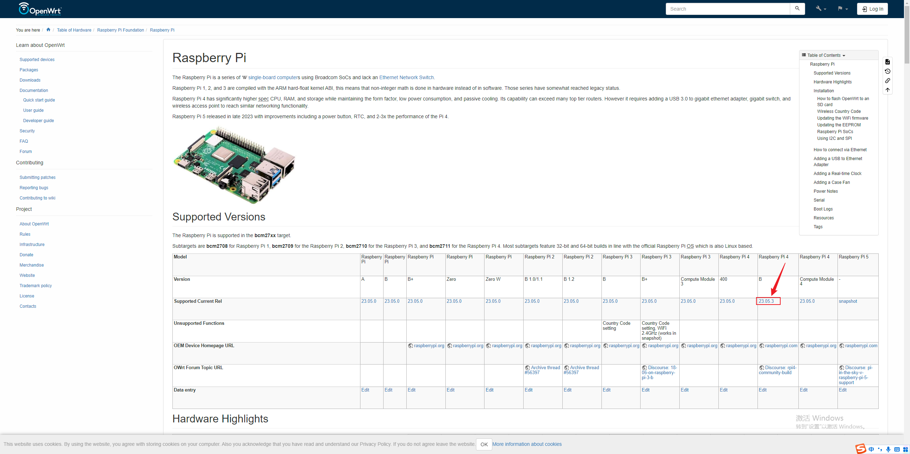
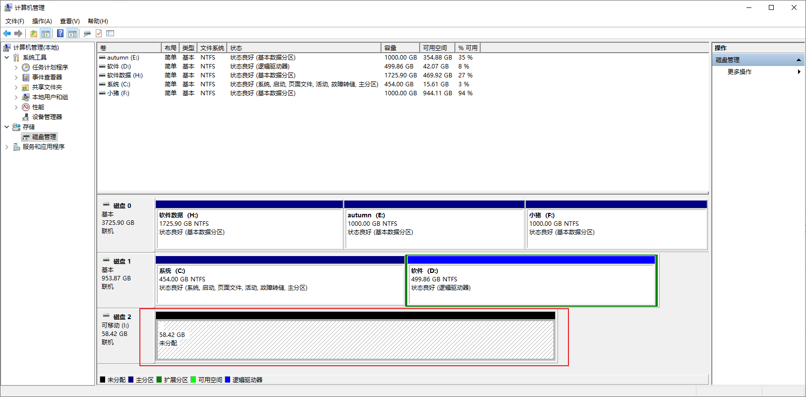
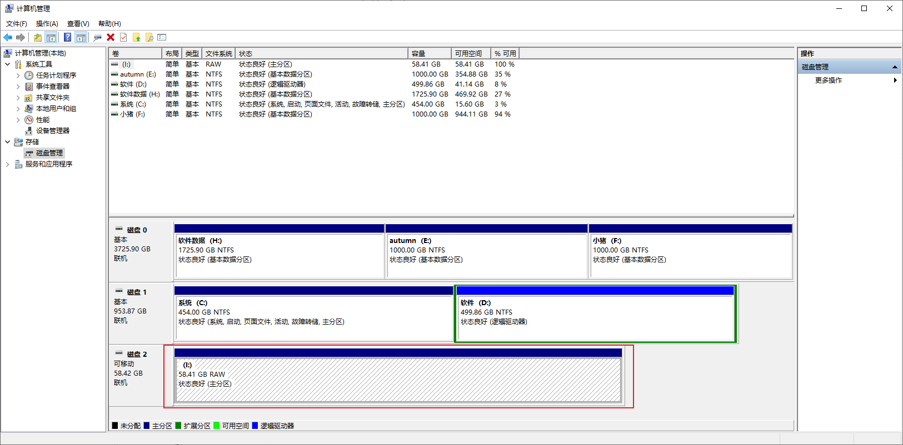
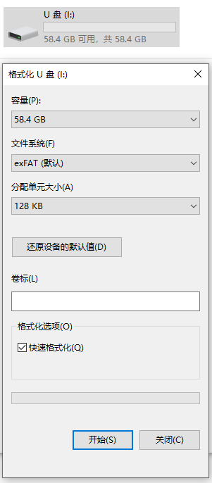
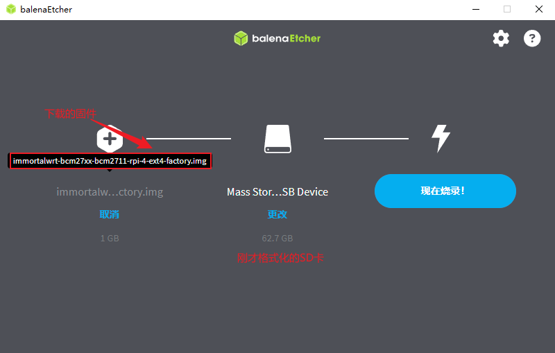
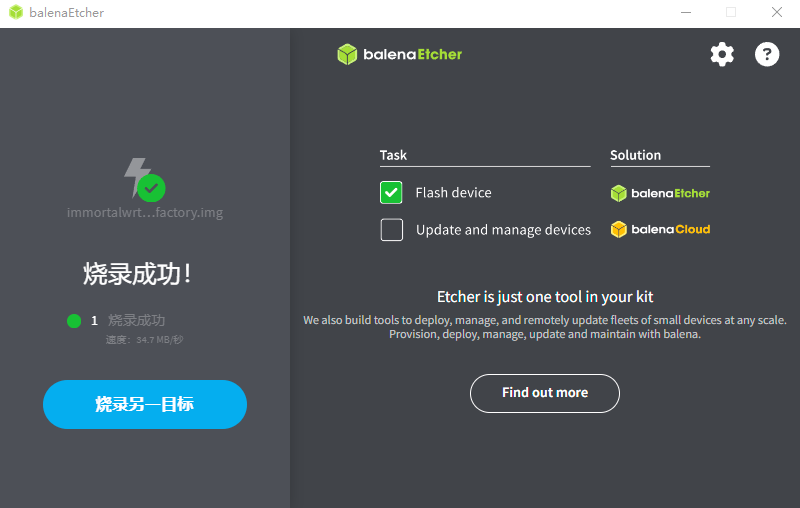
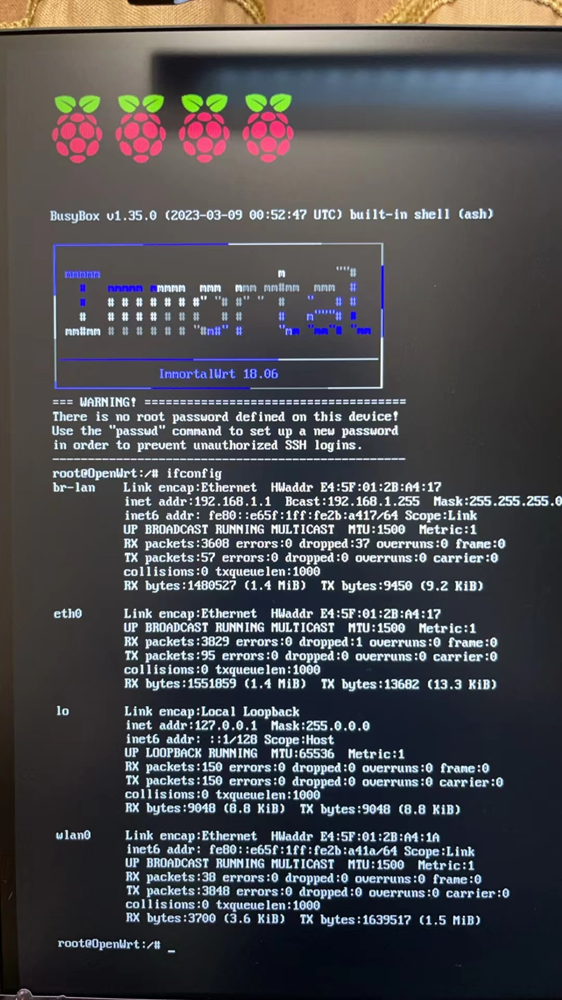
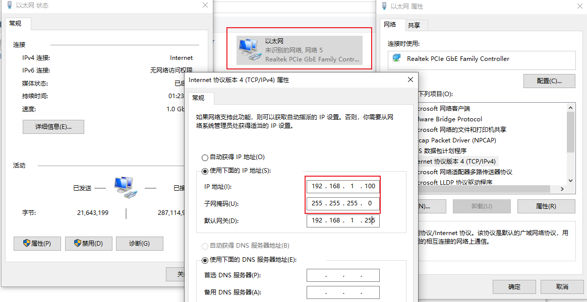
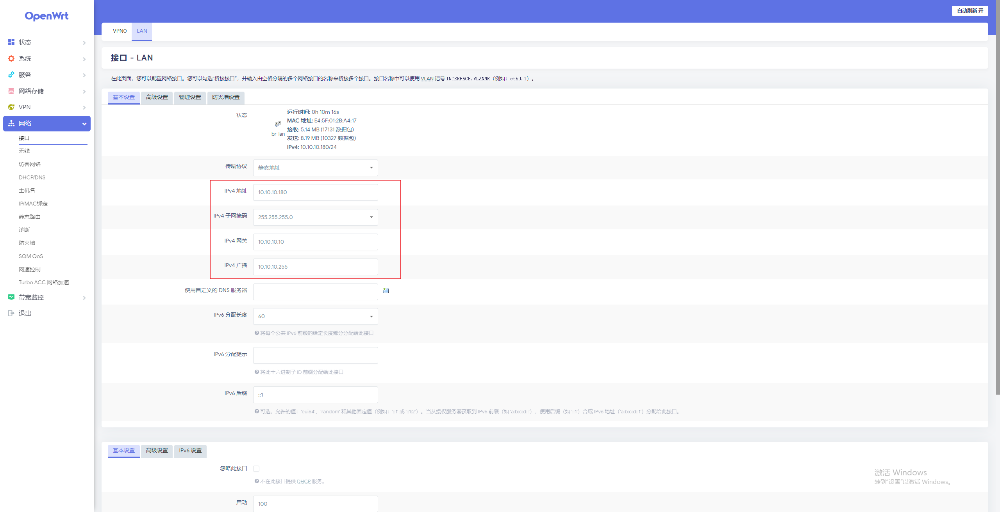

## 准备工作

## 硬件

RaspberryPi4B

Micro SD卡

## 软件

烧录工具:  [balenaEtcher](https://etcher.balena.io/)

固件: [OpenWrt](https://openwrt.org/toh/raspberry_pi_foundation/raspberry_pi)官方固件(注意:官方固件没有插件,需要自己安装,可以刷其他的集成了trojan的OpenWrt版本)

## 烧录SD卡

### SD卡格式化

在计算机管理中将SD卡的卷全部删除。

新建卷

格式化一下，确保能正常格式化！

### balenaEtcher烧录

打开[balenaEtcher](https://etcher.balena.io/)软件，选择固件（压缩包先解压immortalwrt-bcm27xx-bcm2711-rpi-4-ext4-factory.img）和SD卡分区。

烧录完成（烧录失败先格式化SD卡确保SD卡能正常格式化）,如果第一次烧录弹出无法格式化的弹框，把U盘拔下来重插把刚才提示无法格式化的盘符手动格式化,然后再次烧录。

### 测试刷机是否成功

树莓派连接上电源、网线、HDMI线看看是否启动成功。

## 配置网络

查看树莓派IP，插上键盘，用ifconfig命令查看ip地址，树莓派IP的lan口名称为br-lan，IP为192.168.1.1

将电脑的IP改为和树莓派同一个网段。

浏览器输入树莓派的IP，直接访问OpenWrt的管理界面。

设置树莓派的IP地址

再次查看树莓派IP,发现已经更改过来.把电脑的IP也切位之前的DHCP,通过路由器下的地址访问。

## 配置OpenClash 