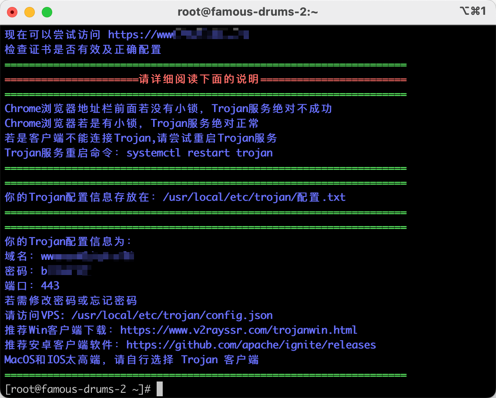

## 环境

系统：CentOS7

WEB Server：Nginx

域名：namecheap（付费域名）

CND：Cloudflare

## 域名托管

将域名托管给Cloudflare，更改namecheap中的nameserver为Cloudflare


在Cloudflare中配置域名并绑定IP


等待一段时间等到域名生效，Cloudflare变成为Active状态，且能ping通方可进行下一步。


## Trojan安装

```bash
# 安装wget命令
yum install -y wget
# 安装acme，用来申请SSL/TLS证书
curl https://get.acme.sh | sh
# 一键安装
wget -N --no-check-certificate -q -O trojan_install.sh "https://raw.githubusercontent.com/xyz690/Trojan/master/trojan_install.sh" && chmod +x trojan_install.sh && bash trojan_install.sh
```


输入www域名


自动安装证书失败


经过手动安装证书和安装trojan2.sh等其他脚本误打误撞证书安装成功。

卸载重装后成功。


### 手动安装证书

old

```bash
# 安装必备软件包
yum install socat
# 安装acme.sh
curl  https://get.acme.sh | sh
source ~/.bashrc #执行后无反应

# 用邮箱注册zerossl账号
acme.sh  --register-account  -m EMAIL@example.com --server zerossl

# 生成证书，生成的证书在~/.acme.sh/下面
acme.sh --server zerossl --issue  -d  YOURDOMAIN.COM --dns dns_cf

#安装证书
sudo ~/.acme.sh/acme.sh --installcert -d MYDOMAIN --fullchainpath /etc/crt/autumn.crt --keypath /etc/crt/autumn.key
```

New

```bash
# 下载acme
curl https://get.acme.sh | sh
# 生成证书
~/.acme.sh/acme.sh --issue -d $your_domain --nginx
# 安装证书
~/.acme.sh/acme.sh --installcert -d $your_domain --key-file /usr/local/etc/trojan/private.key --fullchain-file /usr/local/etc/trojan/cert.crt
# 证书自动升级
~/.acme.sh/acme.sh --upgrade --auto-upgrade
```

### Trojan命令

```bash
# 查看状态
systemctl status trojan.service

# 查看配置文件，重点看remote_addr、remote_port、password
cat /usr/src/trojan-macos/trojan/config.json
```


### Trojan客户端

安卓&windows： V2rayN客户端

IOS&MAC： shadowrocket

添加trojan服务器，输入IP、端口、密码即可


## 其他一键安装trojan

```bash
# 安装trojan
wget -N --no-check-certificate "https://raw.githubusercontent.com/V2RaySSR/Trojansh/master/trojan1.sh" && chmod +x trojan1.sh && ./trojan1.sh
# 安装证书
wget -N --no-check-certificate "https://raw.githubusercontent.com/V2RaySSR/Trojansh/master/trojan2.sh" && chmod +x trojan2.sh && ./trojan2.sh
# 最终配置
wget -N --no-check-certificate "https://raw.githubusercontent.com/V2RaySSR/Trojansh/master/trojan3.sh" && chmod +x trojan3.sh && ./trojan3.sh

#安装bbr一键加速
wget -N --no-check-certificate "https://github.com/ylx2016/Linux-NetSpeed/releases/download/sh/tcp.sh" && chmod +x tcp.sh && ./tcp.sh
```



## 
