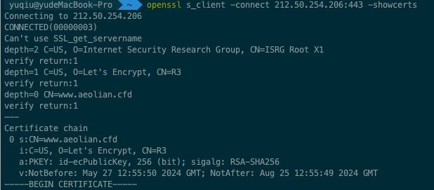

## 环境

系统：CentOS7

WEB Server：Nginx

域名：namecheap（付费域名）

CND：Cloudflare

## 域名托管

将域名托管给Cloudflare，更改namecheap中的nameserver为Cloudflare


在Cloudflare中配置域名并绑定IP


如果是三级域名，则选择Type为A，Name为前缀(第三级)即可。


等待一段时间等到域名生效，Cloudflare变成为Active状态，且能ping通方可进行下一步。


## Trojan

### 1.SSH远程连接

新建ssh文件,或者直接ssh root@IP -p 22连接

```bash
# 启动一个子进程
spawn ssh root@IP -p 22
# 当出现password:字样时
expect "password:"  
# 像子进程发送密码
send "PWD" 
# 控制权交还给用户
interact 
```

用expect ssh文件路径执行脚本文件.

### 2.安装前置命令

```bash
# 1.安装wget和tar命令
yum install -y wget
yum install -y tar
```

### 3.安装acme.sh

安装acme工具，用来申请SSL/TLS证书

```bash
# 2.安装acme工具，用来申请SSL/TLS证书
curl https://get.acme.sh | sh
```


如果安装时提示发行证书过期,更新CA证书即可

```bash
#centos更新CA证书
sudo yum update ca-certificates
```


### 4.安装trojan步骤

```bash
# 3.一键安装
wget -N --no-check-certificate -q -O trojan_install.sh "https://raw.githubusercontent.com/xyz690/Trojan/master/trojan_install.sh" && chmod +x trojan_install.sh && bash trojan_install.sh
```


输入www域名,自动申请证书,注意申请后的ssl证书等级


等待安装成功


### 5.检测服务安装是否成功

#### 检查服务端

```bash
#状态查询,确保服务正常运行
systemctl status trojan
```

#### 查看端口

注意这里智能查看是否开放,ssl导致的服务无法使用端口依然是不能用的.

```bash
tcping google.com 443
```

#### 检查ssl

```bash
#查看证书等级
openssl s_client -connect IP:443 -showcerts
```

#### 浏览器访问

浏览器输入https://域名:443,看网页是否能够被访问

```bash
#页面所在位置
/usr/share/nginx/html
```


### Trojan命令

```bash
# 查看状态
systemctl status trojan.service

#启动
systemctl start trojan

#重启
systemctl restart trojan

#关闭
systemctl stop trojan

#状态查询（如果有显示绿色active(running)，就表示正常运行中）
systemctl status trojan

#持续查看输出日志
journalctl -u trojan -f

#错误查询
journalctl -e -u trojan.service

#开机自动启动
systemctl enable trojan

#禁止开机自动启动
systemctl disable trojan

# 查看配置文件，重点看remote_addr、remote_port、password
cat /usr/src/trojan-macos/trojan/config.json
# 查看进程使用的哪个配置文件
ps -ef|grep trojan
cat /usr/src/trojan/server.conf
```


### Trojan客户端

安卓&windows： V2rayN客户端

IOS&MAC： shadowrocket

添加trojan服务器，输入IP、端口、密码即可


## 验证ssl证书

```bash
openssl s_client -connect yourserver:port -showcerts
```



## 手动安装证书

自动安装证书失败时,需要手动安装证书


经过手动安装证书和安装trojan2.sh等其他脚本误打误撞证书安装成功。安装证书成功后需要卸载重装。

```bash
# 下载acme
curl https://get.acme.sh | sh
# 生成证书
~/.acme.sh/acme.sh --issue -d $your_domain --nginx
# 安装证书
~/.acme.sh/acme.sh --installcert -d $your_domain --key-file /usr/local/etc/trojan/private.key --fullchain-file /usr/local/etc/trojan/cert.crt
# 证书自动升级
~/.acme.sh/acme.sh --upgrade --auto-upgrade
```


## 一键安装bbr加速

```bash
wget --no-check-certificate https://github.com/teddysun/across/raw/master/bbr.sh && chmod +x bbr.sh && ./bbr.sh
```

## 安装问题

### ssh远程连接密钥问题

当出现这个问题时,说明之前的密钥相冲突,vi ~/.ssh/know_hosts,将第四行(服务器IP开头)删掉.然后再次ssh连接,用密码连接即可


curl https://get.acme.sh | sh执行时报错,无tar命令.


### 测试443端口sslv3 alert certificate unknown

通过浏览器的https://IP:443访问时无法打开网页,日志journalctl -u trojan -f输出如下内容


说是tls版本不对,在cloudflare中吧tls版本调成1.3


## 运行异常

### 运行中突然code=exited, status=1/FAILURE


然后使用 journalctl -e -u trojan.service 命令查看错误

```
5月 27 02:21:04 famous-drums-2.localdomain trojan[15795]: Welcome to trojan 1.16.0
5月 27 02:21:04 famous-drums-2.localdomain trojan[15795]: [2024-05-27 02:21:04] [FATAL] fatal: config.json: cannot open file
5月 27 02:21:04 famous-drums-2.localdomain trojan[15795]: [2024-05-27 02:21:04] [FATAL] exiting. . .
5月 27 02:21:04 famous-drums-2.localdomain systemd[1]: trojan.service: control process exited, code=exited status=1
5月 27 02:21:04 famous-drums-2.localdomain trojan[5926]: [2024-05-27 02:21:04] [WARN] got signal: 15
5月 27 02:21:04 famous-drums-2.localdomain trojan[5926]: [2024-05-27 02:21:04] [WARN] trojan service stopped
5月 27 02:21:04 famous-drums-2.localdomain systemd[1]: Stopped trojan.
5月 27 02:21:04 famous-drums-2.localdomain systemd[1]: Unit trojan.service entered failed state.
5月 27 02:21:04 famous-drums-2.localdomain systemd[1]: trojan.service failed.
5月 27 02:21:04 famous-drums-2.localdomain systemd[1]: Started trojan.
5月 27 02:21:04 famous-drums-2.localdomain trojan[15801]: Welcome to trojan 1.16.0
5月 27 02:21:04 famous-drums-2.localdomain trojan[15801]: [2024-05-27 02:21:04] [WARN] trojan service (server) started at 0.0.0.0:443
```


持续输出日志,然后分别执行stop和start命令,发现stop时config.json: cannot open file导致的问题

```bash
#持续查看输出日志
journalctl -u trojan -f
```


重启几次服务器后失败,遂直接重装

### 账号无法登陆

谷歌能上去,但是登陆chatgpt等一些账号登不进去.

解决办法: 关闭SSL/TLS中的自动HTTPS重写.

### root无法登录

ssh使用默认端口22，遭受大量密码尝试达到上限导致。

```bash
#重置次数root用户即可重新登录,重置后
pam_tally2 -r -u root
#新建一个root权限的用户，防止root再被锁，但是22端口还是一直在被攻击
sudo useradd -m -G wheel -s /bin/bash USERNAME && sudo passwd USERNAME

#修改 SSH 配置文件，找到Port 22，修改为其他端口例如2222
sudo vi /etc/ssh/sshd_config
#开放新端口
sudo firewall-cmd --permanent --add-port=2222/tcp
#重新加载防火墙
sudo firewall-cmd --reload
#重新启动SSH服务
sudo systemctl restart sshd
#测试新端口
ssh -p 2222 username@hostname_or_ip
```


### 证书过期SSL handshake failed: sslv3 alert certificate unknown

```bash
#查看状态
systemctl status trojan.service
#查看日志
journalctl -e -u trojan.service
#查看证书状态
openssl s_client -connect www.***.com:443 -showcerts
```

查看证书显示Verify return code: 10 (certificate has expired)


```bash
#修复证书
./trojan_install.sh
#输入之前绑定的域名
www.***.com
```


### SSL handshake failed: wrong version number


一请求就显示SSL handshake failed: wrong version number，结果最后发现是客户端的协议忘记选了。。。分享下协议URL即可看到协议的内容是否正确。


