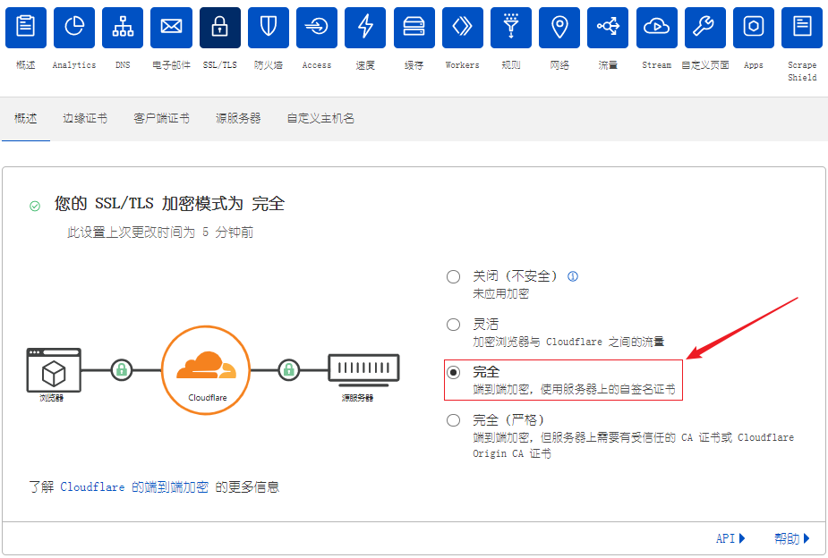

## 环境

系统：CentOS7

WEB Server：Nginx

域名：namecheap（付费域名）/Freenom（免费域名，申请SSL证书须注意不能使用acme）

CND：Cloudflare

## 购买服务器

[Bandwagonhost](https://bandwagonhost.com/aff.php?aff=62182&gid=1)购买VPS服务器并记录**公网IP**、**SSH端口号**及**用户名密码**。


## 购买域名

[Namecheap.com](https://www.namecheap.com/)官网购买域名，购买后[配置域名指定到VPS的公网IP](https://www.namecheap.com/)（这里不配置的话，Cloudflare无法添加站点）。


## Cloudflare配置

### 添加域名站点

进入[Cloudflare](https://www.cloudflare.com/)官网，点击添加站点，输入申请的二级域名，Cloudflare会自动读取域名指向的公网IP并在CF上配置好A Record，这里一定要**关掉Proxy**，让小云朵变成灰色，不然待会TLS证书会申请失败。


点击继续，按照要求把原本的域名DNS Server改为Cloudflare的DNS Server。

```dns
elsa.ns.cloudflare.com
javier.ns.cloudflare.com
```


去域名供应商官网，更改DNS NAMESERVERS为Cloudflare的。


配置完成后去Cloudflare点击完成，检查名称服务器，这里需要等待十几分钟。

### whois

下载链接：[http://nirsoft.net/utils/whoiscl.zip](https://nirsoft.net/utils/whoiscl.zip)

下载解压后，把WhoisCL.exe改名为 whois.exe 并复制到 C:\Windows\System32\目录下即可。

whois 域名，查看申请的域名。

未配置Cloudflare前，whois所有的信息。


使用cloudflare后，Name Server会变成Cloudflare的。


## 安装Nginx

### 准备工具

```shell
 yum install yum-utils
```

### 添加源

```shell
# 进入到yum源目录
cd /etc/yum.repos.d/
# 编辑nginx的yum源
vi nginx.repo
```

添加[源信息](http://nginx.org/en/linux_packages.html#RHEL-CentOS) 

```bash
[nginx-stable]
#软件仓库的名称
name=nginx stable repo
#源的镜像服务器地址
baseurl=http://nginx.org/packages/centos/$releasever/$basearch/
#是否启用此源 1:启用 0:禁用
enabled=1
#是否gpg验证 1:是 0:否
gpgcheck=0
#gpg验证key
gpgkey=https://nginx.org/keys/nginx_signing.key

[nginx-mainline]
name=nginx mainline repo
baseurl=http://nginx.org/packages/mainline/centos/$releasever/$basearch/
enabled=0
gpgcheck=1
gpgkey=https://nginx.org/keys/nginx_signing.key
```

### Nginx常用命令

```shell
#查看源是否添加成功
yum search nginx

#安装nginx
yum install nginx -y

#安装完后，查看
rpm -qa | grep nginx 

#启动nginx
systemctl start nginx

#加入开机启动
systemctl enable nginx

#查看nginx的状态
systemctl status nginx
```

### 测试

启动成功后浏览器输入IP:80即可访问nigix

lsof -i:80可查看80端口被那个进程占用。

## 安装TLS证书

```shell
# 安装必备软件包
yum install socat
# 安装acme.sh
curl  https://get.acme.sh | sh
source ~/.bashrc #执行后无反应
# 停止nginx
systemctl stop nginx
```

### 生成证书

[acme使用ZeroSSL的CA证书](https://github.com/acmesh-official/acme.sh/wiki/ZeroSSL.com-CA)。

```shell
# 用邮箱注册zerossl账号
acme.sh  --register-account  -m EMAIL@example.com --server zerossl
```

[获取CloudFlare API Key](https://github.com/acmesh-official/acme.sh/wiki/dnsapi)，获取[Global API Key](https://dash.cloudflare.com/profile/api-tokens)。


```shell
# 设置Cloudflare的API Key
export CF_Key="ccxxxxxxxxxxxxxxxxxxxb"
export CF_Email="xxxx@sss.com"
```

生成证书

```shell
acme.sh --server zerossl --issue  -d  YOURDOMAIN.COM --dns dns_cf
```

证书生成成功


安装证书， 默认生成的证书都放在安装目录下: ~/.acme.sh/, 不要直接使用此目录下的文件， 正确的使用方法是使用 –installcert 命令,并指定目标位置, 然后证书文件会被copy到相应的位置。

```shell
#安装证书
sudo ~/.acme.sh/acme.sh --installcert -d MYDOMAIN --fullchainpath /etc/crt/autumn.crt --keypath /etc/crt/autumn.key
```

### 配置CF加密模式

申请配置好之后，因为用CF做代理，所以要把SSL/TLS加密模式设为完全模式，**端到端加密，使用服务器上的自签名证书**。



### 遇到的问题

生成证书时，如果出现如下问题，原因是zerossl不再支持免费域名更换，需要更换为付费域名。

生成证书时如果遇到下面这个问题，需要去/root/.acme.sh下面把生成指定的证书删除干净。

## V2ray

### 安装V2ray

```bash
yum -y install wget
wget --no-check-certificate -O v2ray.sh https://git.io/v2ray.sh
chmod +x v2ray.sh 
./v2ray.sh 2>&1 | tee v2ray.log
```

选择ws+tls


脚本会自动安装以下文件： /usr/bin/v2ray/v2ray：V2Ray 程序；

/usr/bin/v2ray/v2ctl：V2Ray 工具；

/etc/v2ray/config.json：配置文件；

/usr/bin/v2ray/geoip.dat：IP 数据文件

/usr/bin/v2ray/geosite.dat：域名数据文件

### 修改V2ray配置

```bash
vi /etc/v2ray/config.json
```

内容如下

```json
{
  "log": {
	"access": "/var/log/v2ray/access.log",
	"error": "/var/log/v2ray/error.log",
	"loglevel": "warning"
  },
  "inbounds": [
    {
      "port": 10000,  #端口和nginx代理的端口一致
      "listen":"127.0.0.1",  #只监听 127.0.0.1，避免除本机外的机器探测到端口,如果要所有机器检测到可以写0.0.0.0
      "protocol": "vmess",
      "settings": {
        "clients": [
          {
            "id": "b831381d-6324-4d53-ad4f-8cda48b30811", #uuid
            "alterId": 64   #和客户端保持一致
          }
        ]
      },
      "streamSettings": {
        "network": "ws",
        "wsSettings": {
        "path": "/video/"       #注意：和Nginx中配置一致，两个斜杠不能省略
        }
      }
    }
  ],
  "outbounds": [
    {
      "protocol": "freedom",
      "settings": {}
    }
  ]
}
```

### v2ray常用命令

```bash
v2ray info //查看 V2Ray 配置信息
v2ray config //修改 V2Ray 配置
v2ray link //生成 V2Ray 配置文件链接
v2ray infolink //生成 V2Ray 配置信息链接
v2ray qr //生成 V2Ray 配置二维码链接
v2ray ss //修改 Shadowsocks 配置
v2ray ssinfo //查看 Shadowsocks 配置信息
v2ray ssqr //生成 Shadowsocks 配置二维码链接
v2ray status //查看 V2Ray 运行状态
v2ray start //启动 V2Ray
v2ray stop //停止 V2Ray
v2ray restart //重启 V2Ray
v2ray log //查看 V2Ray 运行日志
v2ray update //更新 V2Ray
v2ray update.sh //更新 V2Ray 管理脚本
v2ray uninstall //卸载 V2Ray
```

## Nginx配置TLS和V2ray

为Nginx配置tls证书和V2ray代理。

```bash
vi /etc/nginx/nginx.conf
```

内容如下:

```json
#pid 需要mkdir /usr/local/nginx/logs -p 否则不能开机自启
#pid /usr/local/nginx/logs/nginx.pid;   #yum安装的不需要

http {
	server {
	  listen  443 ssl;
	  #如果systemctl status nginx.service报错nginx: [warn] the "ssl" directive is deprecated, use the "listen ... ssl" directive instead,需要删除ssl on
	  ssl on;    
	  ssl_certificate       /etc/crt/autumn.crt;   #这里根据安装的证书路径填写,非fullchain路径
	  ssl_certificate_key   /etc/crt/autumn.key;   #这里根据安装的证书路径填写
	  ssl_protocols         TLSv1 TLSv1.1 TLSv1.2;
	  ssl_ciphers           HIGH:!aNULL:!MD5;
	  server_name           DOMAIN;     #域名
		location /video/ {    #与V2Ray服务端 配置中的 path 保持一致
		proxy_redirect off;
		proxy_pass http://127.0.0.1:10000;  #这个端口和服务端保持一致
		proxy_http_version 1.1;
		proxy_set_header Upgrade $http_upgrade;
		proxy_set_header Connection "upgrade";
		proxy_set_header Host $http_host;

		# Show realip in v2ray access.log
		proxy_set_header X-Real-IP $remote_addr;
		proxy_set_header X-Forwarded-For $proxy_add_x_forwarded_for;
		}
	}
}
```

然后启动nginx即可，如果IP被Ban了记得把Cloudflare的Proxy打开。

```bash
#启动nginx
systemctl start nginx
v2ray url
```

配置完后先检查配置文件有无问题.

```bash
#检查配置文件，出现nginx: invalid option: "/etc/nginx/nginx.conf"问题依然可以启动nginx
nginx -t /etc/nginx/nginx.conf

#查看端口调用情况
lsof -i:443

#使用指定的配置文件而不是conf目录下的nginx.conf
# nginx -c <path_to_config>
```

## 日志查看

```bash
#查找服务的日志
lsof -p 进程ID|grep log

#查看nginx的error日志
#104: Connection reset by peer连接重置是正常情况
tail -f /var/log/nginx/error.log

#查看nginx的access日志
#代理成功后连接时会带有101状态码(Switching Protocols，切换协议)
#成功示例: "GET /video/ HTTP/1.1" 101 0 "-" "Go-http-client/1.1"
tail -f /var/log/nginx/access.log

#查看v2ray的access日志
#代理成功后,nginx会把请求转发给v2ray
#成功示例: tcp:61.YOUR.IP.ADDRRESS:30862 accepted tcp:www.baidu.com:443
tail -f /var/log/v2ray/access.log

#查看v2ray的error日志
#v2ray.com/core/app/proxyman/inbound: connection ends连接关闭时正常情况
tail -f /var/log/v2ray/error.log
```