## 原理

**基本原理：**

【客户端】- 通过其他的代理相关软件，在本地抓包拦截原神客户端发向官方服务器的网络请求，并转而发送向自建的服务器（可以搭建在本地机器）

【服务端】- 接收客户端发来的请求并模拟原版返回值，由于可以自定义数据，故而实现了自由度极高的私服功能。类似的东西还有很多，Grasscutter只是其中的一个。

## Linux服务器

服务器版本：CentOS7

### 更换源

```bash
#挂载阿里云yum源
wget -O /etc/yum.repos.d/CentOS-Base.repo http://mirrors.aliyun.com/repo/Centos-7.repo
#清理yum
yum clean all
```

### 关闭防火墙和selinux

**如果购买的是服务器，需要到服务商防火墙配置界面（如腾讯云），设置防火墙策略！！！
逐步开放8080端口、22102端口、444端口、9001端口**

#### 关闭防火墙

```bash
systemctl stop firewalld.service
```

**设置防火墙开机不自启**

```bash
systemctl disable firewalld.service
```

查看防火墙状态

```bash
firewall-cmd --state
```

#### 关闭selinux

```bash
vi /etc/selinux/config
```

**把SELINUX=enable**
**改成SELINUX=disabled**

重启服务器

```bash
reboot
```

**开机查看selinux状态（disable为关闭）**

```bash
sestatus
```

## Docker安装

### 安装依赖包

```bash
yum install -y yum-utils device-mapper-persistent-data lvm2
```

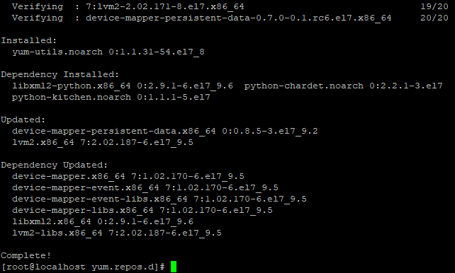

### 添加Docker镜像源

```bash
yum-config-manager --add-repo http://mirrors.aliyun.com/docker-ce/linux/centos/docker-ce.repo
```

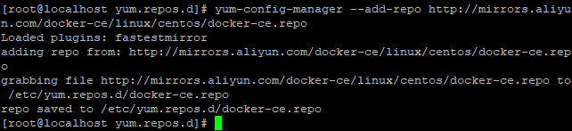

### 安装Docker

```bash
yum install docker-ce docker-ce-cli containerd.io
```

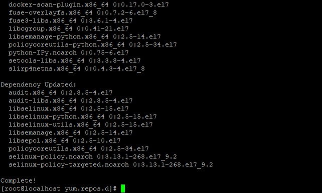

### 启动Docker

```bash
systemctl start docker
```

## 部署原神服务端

### 拉取grasscutter镜像

```bash
#需要先启动docker
docker pull evendevil66/grasscutter
#查看是否拉取成功
docker images
```

可以使用**docker images** 查看是否拉取成功

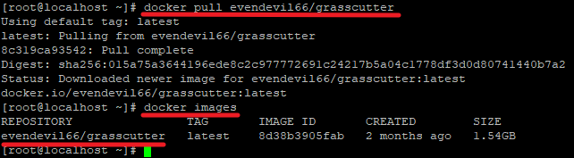

### 部署服务端到docker

下载元神服务端，上传并解压到 `/root`，使用 `ls /root`可以看到目录下已经多了 `full-grasscutter-"version"`文件夹

```bash
#根据压缩文件类型安装unzip
yum install unzip
cd /root
#解压
unzip full-grasscutter-3.0-Beta.9.rar
```

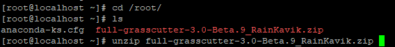

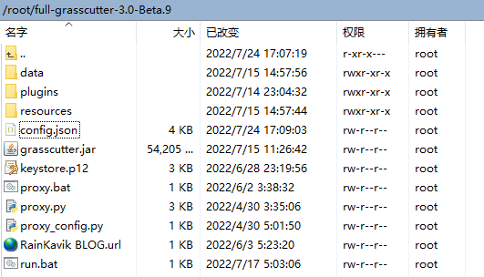

### 更改config.json

打开服务端目录下的 `congfig.json` 编辑里面的 `accessAddress`默认是127.0.0.1 **更改为服务器的IP地址（共2处要更改）**

注意那个443一定要改成444端口!!!

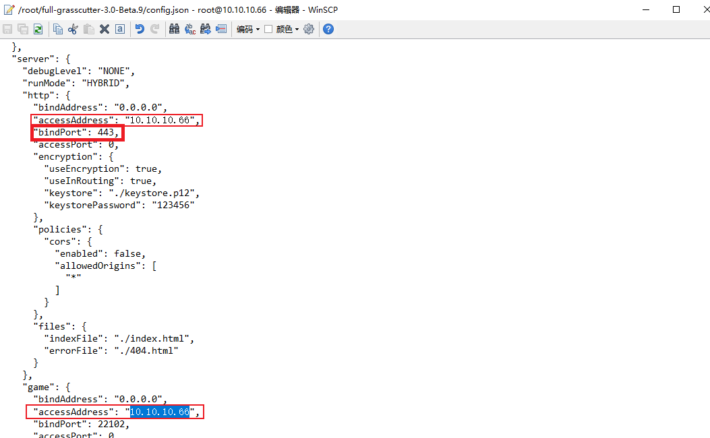

### 以docker运行上传的原神服务端

```bash
#运行容器
docker run -dit \
-v /root/full-grasscutter-3.0-Beta.9:/var/grasscutter \
-p 444:444 \
-p 444:444/udp  \
-p 22102:22102 \
-p 22102:22102/udp \
-p 8080:8080 \
-p 8080:8080/udp \
-p 9001:9001 \
-p 9001:9001/udp \
--name grasscutter \
-v /sys/fs/cgroup:/sys/fs/cgroup \
--restart always \
--privileged=true evendevil66/grasscutter /usr/sbin/init

#查询容器(所有的)
docker container ls -all
#删除当前容器
docker container rm mycentos
```

/root/full-grasscutter-3.0-Beta.9是元神服务端解压后的文件夹，：后面/var/grasscutter是容器目录。

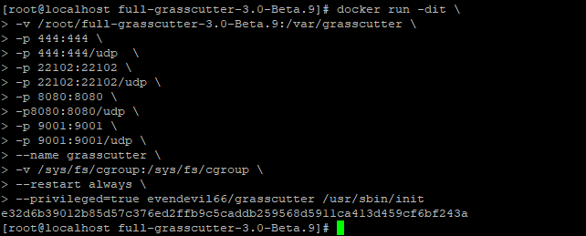

#### docker容器操作

```bash
#查看docker镜像(运行中的)
docker ps
#查询容器(所有的)
docker container ls -all

#启动单个容器
docker start <CONTAINER ID>

#进入容器
docker exec -it CONTAINERID /bin/bash

#闭所有容器
docker stop $(docker ps -a -q)

#关闭单个容器
docker stop <CONTAINER ID>

#删除所有容器
docker rm $(docker ps -a -q)

#删除单个容器
docker rm <CONTAINER ID>
```


### 测试服务端

**在服务器内使用浏览器**输入 `"服务器IP地址"+端口号9001` 即可查看运行状态

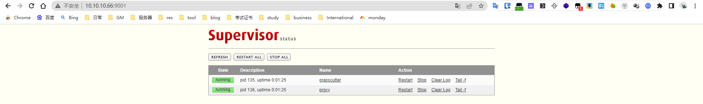

### 安装plugin

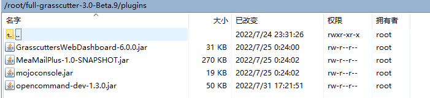

将插件拖拽到物理机的/root/full-grasscutter-3.0-Beta.9/plugins下面

```bash
# 将物理机文件夹中的文件复制到容器里指定文件夹的位置
docker cp /root/full-grasscutter-3.0-Beta.9/plugins grasscutter:/var/grasscutter/plugins
docker exec -it grasscutter /bin/bash            # 进入grasscutter容器
cd /var/grasscutter                                  # 进入刚刚复制进去的文件夹
# 退出docker，重启容器，也可以在docker容器内部启动grasscutter文件java -jar grasscutter.jar
docker stop grasscutter
docker start grasscutter
```

#### Grasscutter Tools

修改服务器地址，https://10.10.10.66:444，点击查询，右侧服务器状态->远程执行插件显示对号说明成功。

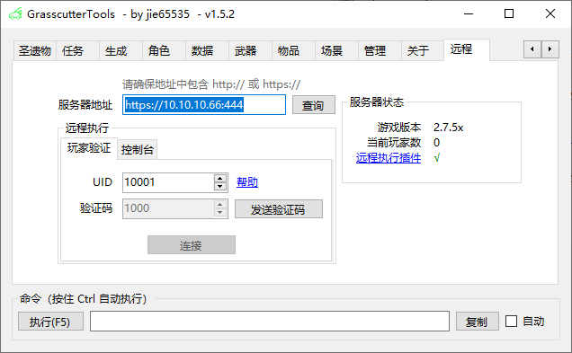

## 进入割草机环境

```bash
#进入docker容器
docker exec -it grasscutter /bin/bash
supervisorctl
fg grasscutter
```

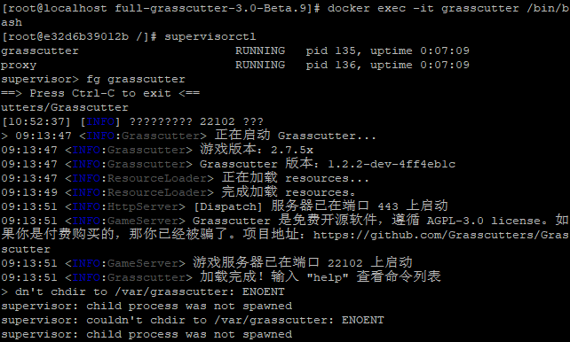

**完成以上操作就可以开始创建账号了**

### 创建账号

,默认不可以自动注册，需要使用 `account` 指令在控制台创建账号才可以登录；

```bash
创建方法如下：
语法：`account create 登录账号 UID`
例如：`account create autumn 123456`
```

也可以更改配置允许不存在的账号自动注册（不建议开启）。

### 自定义配置

config.json

卡池配置文件为 `.\data\Banners.json` ，其中

- `gachaType=200,scheduleId=893` 的为常驻池
- `gachaType=301,scheduleId=903` 的为角色 UP 池 (多 UP: 增加 `gachaType` 为 302,303,304… 的成员即可)
- `gachaType=400,scheduleId=913` 的为武器 UP 池

多卡池：增加 `gachaType` 为非以上四个值的成员即可，注意客户端只识别以上四个 `gachaType` 值，添加的其他卡池不会显示类型

本站整合包默认为万达桃三 UP 及前两者专武 (专武封面为前者，是客户端内置资源，无法修改)

`rateUpItems1` 为 UP 五星，`rateUpItems2` 为 UP 四星，对应 id 在 `Handbook_CHS.txt` 中可以找到

需修改 `prefabPath` `previewPrefabPath` `titlePath` 中的 `A0**` 为对应的卡池 id（在 `卡池顺序.xlsx `中）

`costItem` 为抽卡耗费的货币名称，`223` 为纠缠之缘，`224` 为相遇之缘（修改可能会引发 bug）

`sortId` 为卡池排序，越大越靠前

`beginTime` `endTime` 为卡池开始 / 结束的 10 位时间戳

`softPity` 最少几次出 `hardPity` 最多几次出 `eventChance` 歪的概率 % ，如果没有这三个成员自己加上即可

`bannerType` 为 `STANDARD` 表示常驻池，`EVENT` 表示角色 UP 池，`WEAPON` 表示武器 UP 池 (这个参数貌似只是看的)


## 客户端

### 444不通

因为客户端不能直接改配置文件，所以只能改代理，把请求原神服务器的ip:端口重定向到私服的IP:端口。私服的端口为444。

telnet IP 444发现不通，服务器中telent IP 444不通，但是telnet 127.0.0.1 444居然是通的。

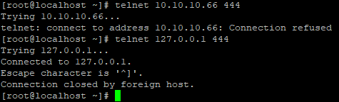

#### 查看端口号情况

```bash
#查看端口号情况
netstat -nplt
```

服务器的几个端口都处于监听状态

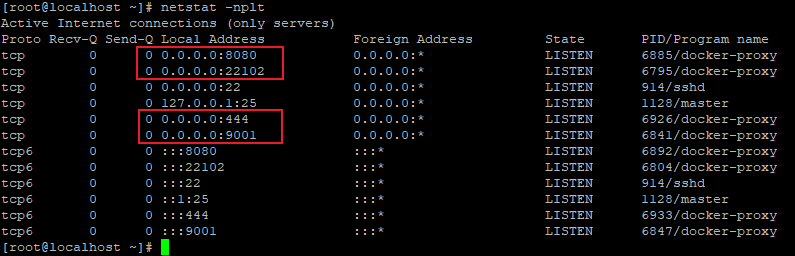

#### 查看转发列表

```bash
#查看转发列表
iptables -t nat -nL
```

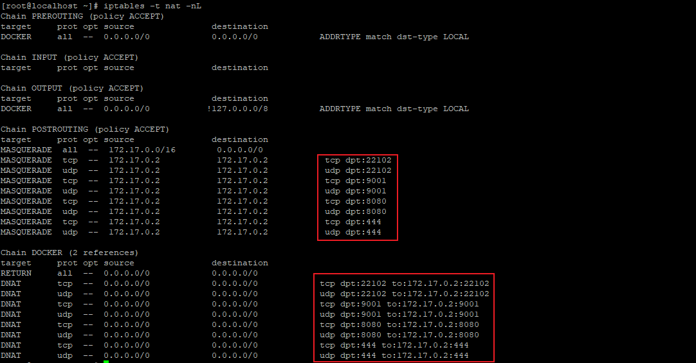

#### 查看内核转发状态

确保ipv4处于开启状态

```bash
#查看内核转发状态
sysctl net.ipv4.ip_forward
#开启内核转发
echo 1 > /proc/sys/net/ipv4/ip_forward
sysctl -p
```

#### 进入docker容器

```bash
#进入容器
docker exec -it CONTAINERID /bin/bash
#退出容器
exit
```

##### 查看端口号情况

```bash
#查看监听的tcp端口情况
netstat -nplt
#查看监听的udp端口情况
netstat -nplu
```

docker处于监听状态的端口，tcp有9001和8080，udp有22102，唯独没有444端口。

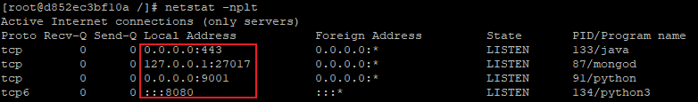

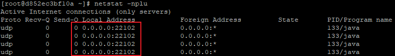

发现是前面解压后config.json文件没把443改为444，直接进入容器中vi /var/grasscutter/config.json更改后重启即可。

### 客户端代理方式

#### flidder拦截重定向

打开Fiddler，菜单栏 Tool -> options -> https

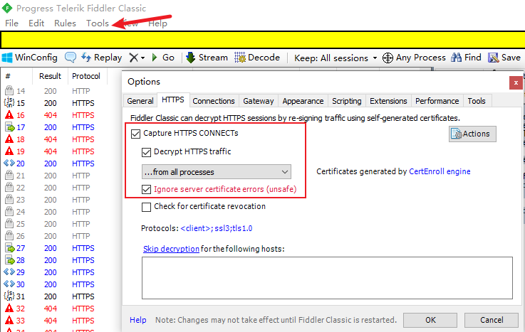

切换到 connections，把端口改成8181，按 OK 保存设置

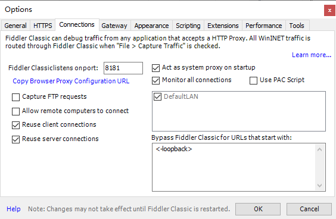

系统代理中出现8181代理端口即为成功。

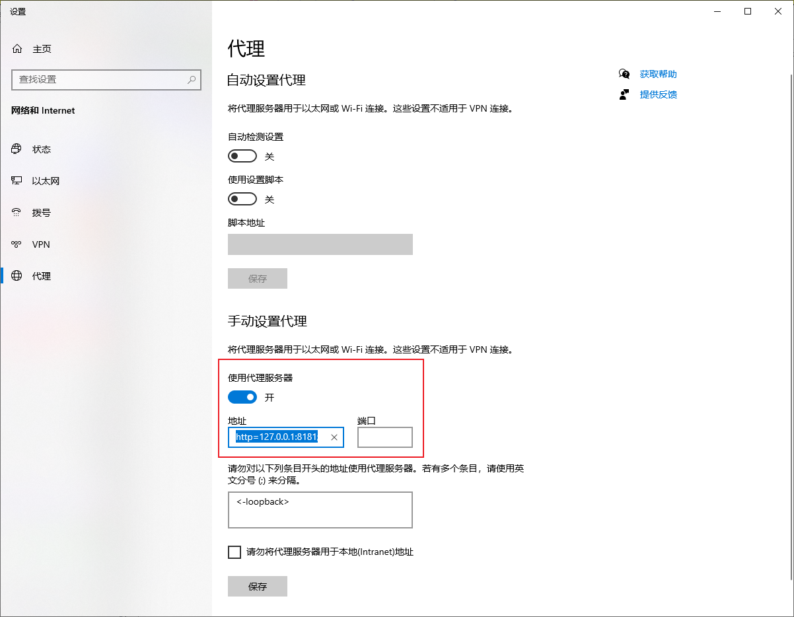

主界面选 Fiddler Script ，清空原来的脚本，粘贴如下内容。脚本中的 oS.host 后面改为服务器的IP地址，最后点左上角SaveScript

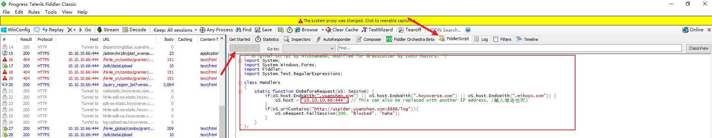

```java
/* Original script by NicknameGG, modified for Grasscutter by contributors. */
import System;
import System.Windows.Forms;
import Fiddler;
import System.Text.RegularExpressions;
 
class Handlers
{
    static function OnBeforeRequest(oS: Session) {
        if(oS.host.EndsWith(".yuanshen.com") || oS.host.EndsWith(".hoyoverse.com") || oS.host.EndsWith(".mihoyo.com")) {
            oS.host = "10.10.10.66:444"; // This can also be replaced with another IP address.（输入域名也可）
        }
        if(oS.uriContains("http://uspider.yuanshen.com:8888/log")){
            oS.oRequest.FailSession(200, "Blocked", "haha");
        }
    }
};
```

#### 直接用Genshin代理助手

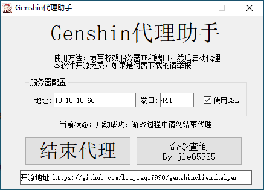

### 客户端成功进入界面

**如果使用的是 国服客户端，启动后有弹窗 (仅 Win) 且登录页面标题为 `HOYOVERSE` 而不是 `miHoYo` 即代表成功连接私服；**

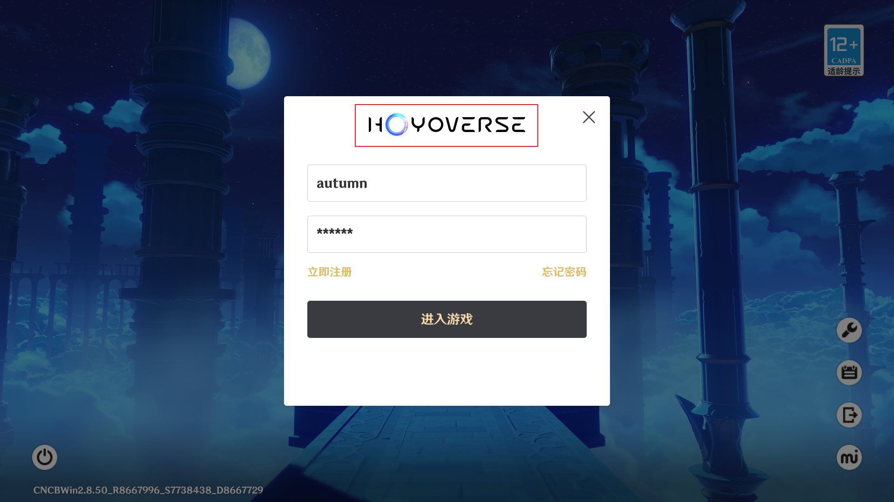


使用命令获得90级刻晴

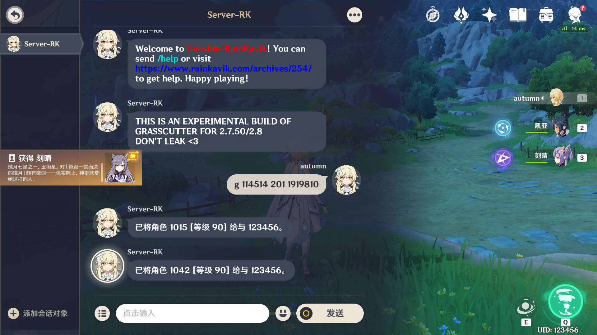