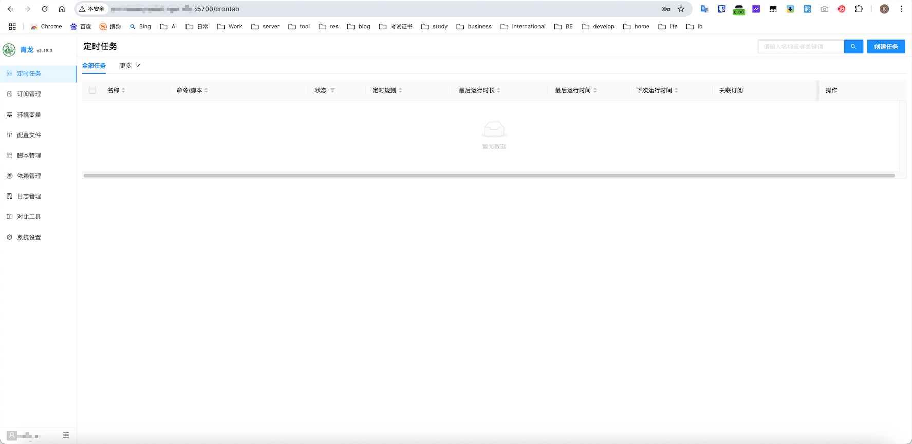
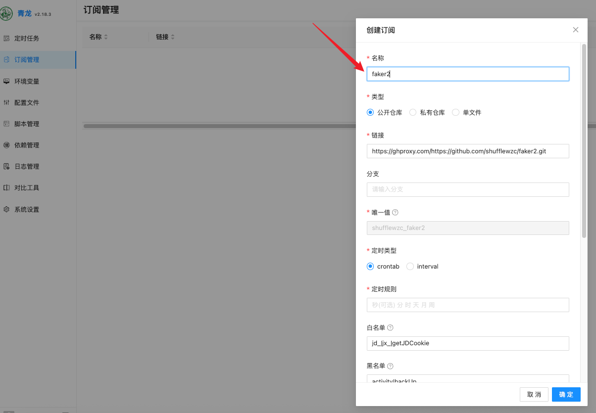
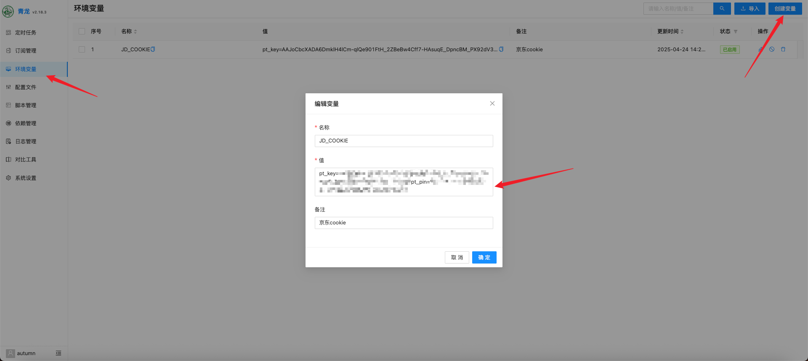

## 常用类

### DDNS-GO

DDNS-GO是一款支持包含阿里云、腾讯云、华为云、Cloudflare等16个DNS解析商的**动态域名解析工具**，支持将安装了DDNS-GO设备的公网IPv4、IPv6定时自动绑定到自定义的域名上。

### OneNav

OneNav是开源的书签管理工具，支持导入chrome、firefox、edge等主流的浏览器数据，拥有账号功能，可以对不同浏览器的书签进行集中管理，方便多设备用户的使用。

### Vaultwarden

Vaultwarden是一款知名的开源密码管理工具，拥有网页、APP、浏览器插件等多种形式支持，可以自动生成密码、回填账号密码、管理账号密码、管理2FA等功能。

### HomeAssistant

大名鼎鼎的HA智能中枢，在小米开放了官方HA插件以后，HA在国内的易用性也越来越好，搭配各式各样的UI、模板、插件，我们可以将手机、平板等代替中枢网关，实现对智能家居的一键管理，创建各式各样的智能化任务。

### cat

## 家庭照片管理类

lomorage（全平台自托管照片管理）

immich（开源家庭相册管理）

photostruct（家庭照片管理工具）

photoview（瀑布流相册管理）

ente（端到端加密相册管理）

## 个人学习类

language-tool（语言在线校验）

memos（碎片化知识记忆、笔记）

habitica（用游戏的方式养成习惯）

traggo（以时间轴为核心的时间管理）

Reference（包含数据库、前端、后端等）‍

## 办公团队协作类

推荐 vikunja、affine、showdoc、heimdallr

erpnext（开源 erp 系统）

wbo（简易在线白板绘图）

o2oa（OA 系统）

panka（项目管理）

our shopping list（todo 工具）

twenty（开源 CRM 项目）

bookstack（知识库）

cloper（调研工具）

huntly（RSS 集成）

kimai（个人时间管理）

snipe-it（IT 设备管理）

vikunja（项目管理）

univer（文档）

iToP（IT 服务管理）

affine（白板、文档）

heimdallr（消息推送）

Superset（BI 数仓系统）

showdoc（知识库）

fiora（即时聊天）

Perlite（知识库）

## 下载雷

### qBittorrent

```bash
services:
  qbittorrent:
    image: linuxserver/qbittorrent
    container_name: qbittorrent
    environment:
      - PUID=1000
      - PGID=1000
      - TZ=Asia/Shanghai # 你的时区
      - UMASK_SET=022
      - WEBUI_PORT=28081 # 将此处修改成你欲使用的 WEB 管理平台端口 
    volumes:
      - /share/Container/qbittorrent/config:/config # 绝对路径请修改为自己的config文件夹
      - /share/downloads:/downloads # 绝对路径请修改为自己的downloads文件夹
      - /share/video:/video
    ports:
      # 要使用的映射下载端口与内部下载端口，可保持默认，安装完成后在管理页面仍然可以改成其他端口。
      - 26881:26881 
      - 26881:26881/udp
      # 此处WEB UI 目标端口与内部端口务必保证相同，见问题1
      - 28081:28081
    restart: unless-stopped
```

用户名密码在容器日志里面显示

**天雪动漫高清论坛**：资源方面以高清动漫资源为主，下载方面以PT下载为主、网盘分享为辅，网站基于Discuz构建。
**U2动漫花园**：国内最为知名的动漫PT站,动漫资源很全，发布速度很快。
**M-Team**：以特色资源(限制级内容)为主的PT站点


## 音乐类

### xiaomusic

官网：https://github.com/hanxi/xiaomusic

支持小米音响

```yml
version: '3'
services:
  xiaomusic:
    image: hanxi/xiaomusic
    container_name: xiaomusic
    restart: unless-stopped
    ports:
      - 58090:8090
    environment:
      XIAOMUSIC_PUBLIC_PORT: 58090
    volumes:
      - /share/Multimedia/music:/app/music
      - /share/Container/xiaomusic/conf:/app/conf
```

### Navidrome / Music-tag-Web

Navidrome是目前docker中最完善的音乐媒体项目，搭配音流APP可以实现不亚于网易云的收听体验。结合music-tag-web这个强大的音乐元数据刮削工具，可以根据歌曲名字从互联网侧刮削几乎所有的音乐封面、歌词、歌手、专辑等信息，让音乐库打造的更完整。

## 漫画

### Komga/Bungumi

```yml
version: '3.3'

services:
  komga:
    image: gotson/komga
    container_name: komga
    volumes:
      - type: bind
        source: /share/Container/komga/config
        target: /config
      - type: bind
        source: /share/Container/komga/data
        target: /data
      - type: bind
        source: /etc/localtime
        target: /etc/localtime
        read_only: true
    ports:
      - 25600:25600
    restart: unless-stopped
```

完成度极高的一款漫画自托管库，搭配Bungumi可以实现漫画、轻小说、番的元数据刮削，是继海报墙之后，漫画/轻小说文库墙的一套解决方案。

teemii（在线漫画下载和管理）

## 影视

### Jellyfin

### Emby

### Plex

onelist（用于 alist 的影视刮削工具）

### 动漫AutoBangumi

官网:https://www.autobangumi.org/home/

#### docker cli部署

```bash
docker run -d \
  --name=AutoBangumi \
  -v /share/Container/AutoBangumi/config:/app/config \
  -v /share/Container/AutoBangumi/config:/app/data \
  -p 27892:7892 \
  -e TZ=Asia/Shanghai \
  -e PUID=$(id -u) \
  -e PGID=$(id -g) \
  -e UMASK=022 \
  --network=bridge \
  --dns=8.8.8.8 \
  --restart unless-stopped \
  ghcr.io/estrellaxd/auto_bangumi:latest
```

#### Docker-compose 部署

```YML
version: "3.8"

services:
  AutoBangumi:
    image: "ghcr.io/estrellaxd/auto_bangumi:latest"
    container_name: AutoBangumi
    volumes:
      - /share/Container/AutoBangumi/config:/app/config
      - /share/Container/AutoBangumi/data:/app/data
    ports:
      - "27892:7892"
    network_mode: bridge
    restart: unless-stopped
    dns:
      - 223.5.5.5
    environment:
      - TZ=Asia/Shanghai
      - PGID=$(id -g)
      - PUID=$(id -u)
      - UMASK=022
```

默认用户名密码admin/adminadmin

### 动漫ani-rss

```YML
version: "3"
services:
  ani-rss:
    container_name: ani-rss
    volumes:
      - /share/Container/ani-rss/config:/config
      - /share/video/animate/:/Media
    ports:
      - 27789:7789
    environment:
      - PORT=7789
      - CONFIG=/config
      - TZ=Asia/Shanghai
    restart: always
    image: wushuo894/ani-rss
```

admin/admin


## 书籍

### TaleBook

TaleBook是一款书籍管理工具，它基于calibre项目构建，具备书籍管理、在线阅读与推送、用户管理、SSO登录、从百度/豆瓣拉取书籍信息等功能。

### Audibookshelf

Audiobookshelf是一款自托管的有声读物和播客服务器，包含web端和app端应用。
双端的浏览记录完全同步，是很不错的一款有声书系统。

### 其他

calibre-web（图书管理）

## 工具类

宝塔（运维面板）

1panel（运维面板）

Excalidraw（在线绘图工具）

WordPress（博客框架）

Gitlab（私人代码库）

Exsi（虚拟机管理）

Uptime Kuma（服务状态监控）

Frps/Frpc（内网穿透）

Vaultwarden（密码管理）

## AI 与生产力工具

2024 年 AI 技术大爆发，云端 AI 服务也能本地部署，AI 与生产力紧密融合！?

Open-WebUI（类 ChatGPT 工具）

Dify（生成式 AI 检索框架）

quivr（基于 AI 的第二大脑）

gpt_academic（学术大模型）

transformer-explainer（大模型可视化）

one-api（大模型 API 中间件）

独角兽发卡

```bash
version: "3"
services:
faka:
    image:hkccr.ccs.tencentyun.com/apocalypsor/dujiaoka:latest
    environment:
      -INSTALL=true
    volumes:
      -./env.conf:/dujiaoka/.env
      -./uploads:/dujiaoka/public/uploads
    ports:
      -56789:80

db:
    image:mariadb:focal
    environment:
      -MYSQL_ROOT_PASSWORD=你的root密码
    volumes:
      -./data:/var/lib/mysql

redis:
    image:redis:alpine
    volumes:
      - ./redis:/data
```


## 羊毛类

### 青龙面板

```bash
docker pull whyour/qinglong:debian
```



> 1.依赖管理添加脚本运行环境，需要先在系统设置中添加镜像NodeJs（镜像https://registry.npmmirror.com）、Python(镜像https://pypi.tuna.tsinghua.edu.cn/simple)、Linux
>
> 环境管理添加脚本使用的Cookie变量
>
> 面板 → 订阅管理中添加脚本仓库

#### 京东京豆

在订阅管理-》创建订阅中直接复制在名称中。



```bash
#Faker集合仓库
ql repo https://github.com/shufflewzc/faker2.git "jd_|jx_|getJDCookie" "activity|backUp" "^jd[^_]|USER|ZooFaker_Necklace"

```

##### 获取cookie

alook` 浏览器里面输入京东官网 `m.jd.com，点击`右上角的登录`或者`右下角的未登录`，进入登录页面，使用手机接收短信的方式进行登录；点击浏览器下面的`三条杠（菜单）`；点击 `工具箱` --> `开发者工具` --> `Cookies` --> `拷贝`；Cookies中的 pt_key 和pt_pin的字段复制下来。

记住用`Alook`获取cookies后千万不要在`Alook`上退出京东账号，否则cookies会失效

青龙面板-》环境变量中新增JD_COOKIE




## 其他

joplin记日记；kanboard管理任务；chromium浏览器；homebox管理物品；openspeedtest测速
