## Docker直接安装V2raya

官网： https://v2raya.org

```bash
#获取最新版镜像
docker pull mzz2017/v2raya
#停止现有版本容器并移除容器
docker container stop v2raya
docker container rm v2raya

#运行容器
docker run -d \
  --restart=always \
  --privileged \
  --network=host \
  --name v2raya \
  -e V2RAYA_LOG_FILE=/tmp/v2raya.log \
  -e V2RAYA_V2RAY_BIN=/usr/local/bin/v2ray \
  -e V2RAYA_NFTABLES_SUPPORT=off \
  -e IPTABLES_MODE=legacy \
  -v /lib/modules:/lib/modules:ro \
  -v /etc/resolv.conf:/etc/resolv.conf \
  -v /share/Container/v2raya:/etc/v2raya \
  mzz2017/v2raya

#查看状态
docker container stats v2raya
```

安装完之后端口为2017，通过http://IP:2017端口访问。

## Container Station安装V2rayA

### 新建容器

镜像为Docker Hub的“mzz2017/v2raya:latest”

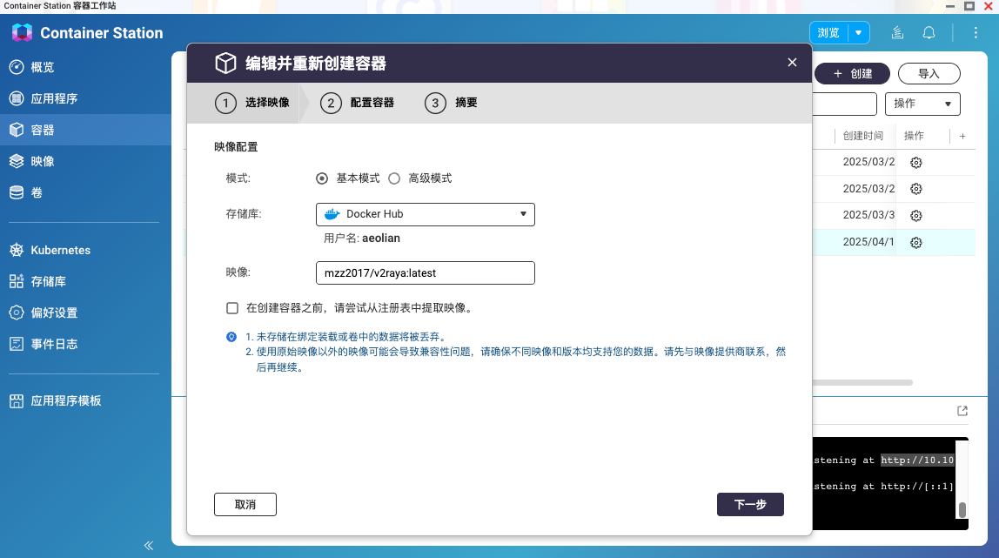

### 配置容器

配置好网络和主机端口

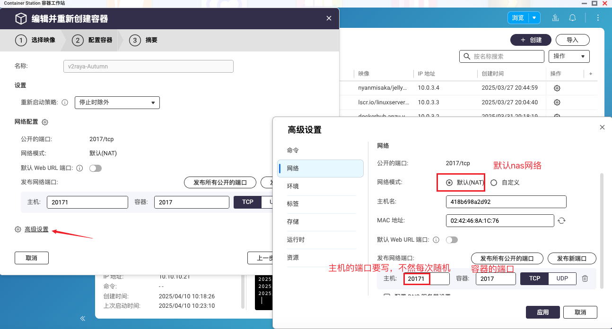

### 确认测试

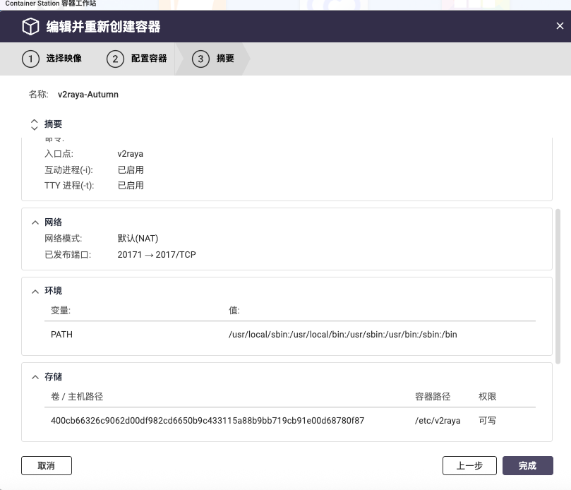

创建完成后复制端口转发

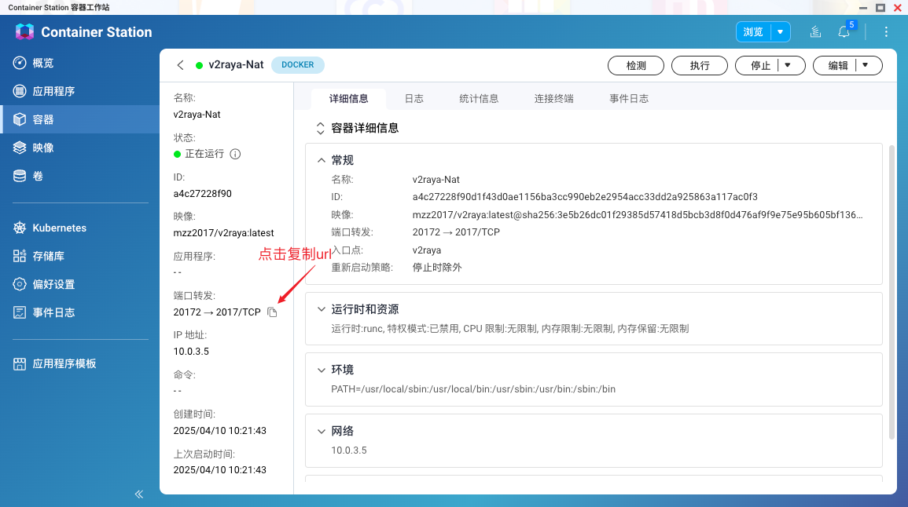

### 创建管理员账号密码

复制进去进入V2raya管理员创建界面，如果忘记密码可以使用重置密码命令

```bash
#v2raya命令重置密码
sudo v2raya --reset-password
```

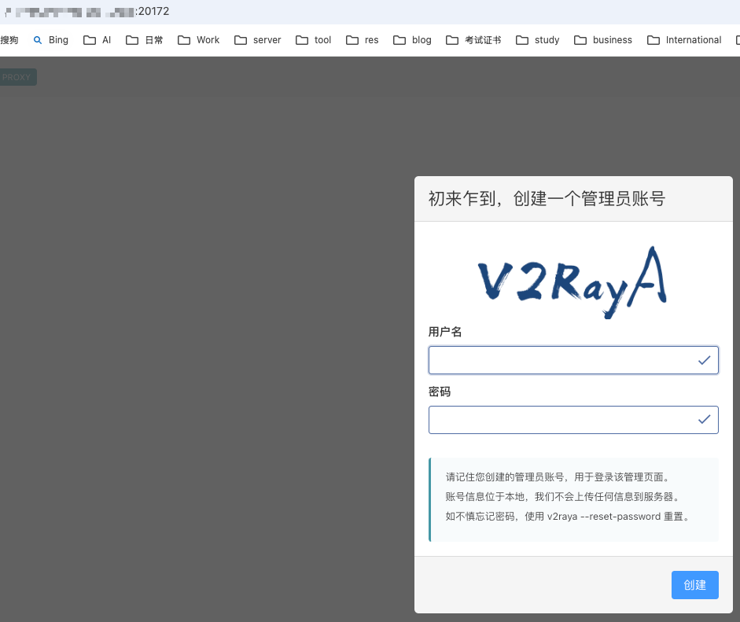

### 创建节点并启动

登陆后创建节点-》连接节点-》启动。

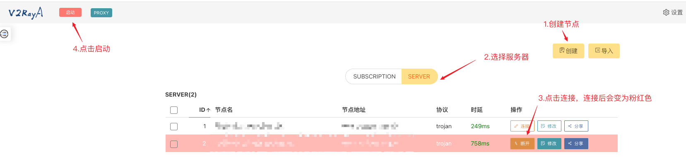

启动后由粉红色变为蓝色表示成功。

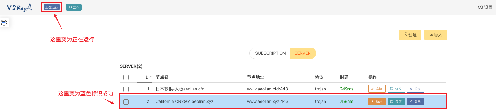

### 配置代理

默认情况下 v2rayA 会通过核心开放 20170(socks5), 20171(http), 20172(带分流规则的http) 端口。

如果是需要为局域网中的其他机器提供代理，在设置中打开“局域网共享”，并检查防火墙开放情况。

#### 透明代理

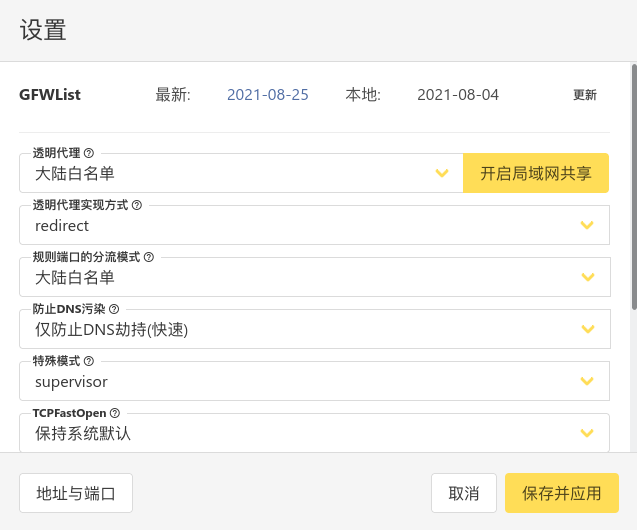

这种方法是 v2rayA 推荐的方法。它相比于其他方法具有诸多优势，v2rayA 可以一键开启透明代理，为**几乎所有程序**提供代理服务。

在设置中选择透明代理的分流方式，以及实现方式，然后保存即可。

注意，如需选择 GFWList，需要下载对应的规则库，请点击右上角的更新以完成下载。

#### 系统代理

系统代理可为**主动支持代理的程序**提供代理服务。在不同的桌面环境中设置的位置不尽相同，请通过搜索引擎自行搜索。

#### SwitchyOmega

SwitchyOmega 等浏览器插件可为**浏览器**提供代理服务。具体方法请通过搜索引擎自行搜索。

## Container Station使用代理

编辑container-station的run-docker.sh脚本，添加代理

```bash
# 编辑脚本文件
vi /share/CACHEDEV1_DATA/.qpkg/container-station/script/run-docker.sh

# 在倒数第二行添加如下配置
# docker设置代理
export http_proxy="http://server:port"
export https_proxy="http://server:port"
export no_proxy= "localhost,127.0.0.0/8,192.168.0.0/16,172.16.0.0/12,10.0.0.0/8"

# 重启container station生效
/etc/init.d/container-station.sh restart
```

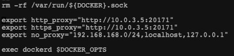

### 使用后依然无法访问docker hub

在docker中又添加了一个桥接模式的网络

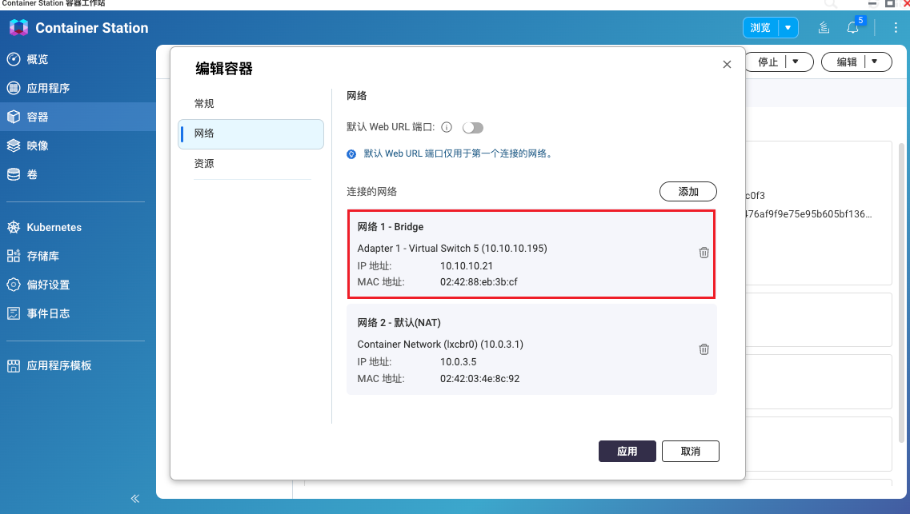

测试这两个网络，发现端口都是通的。

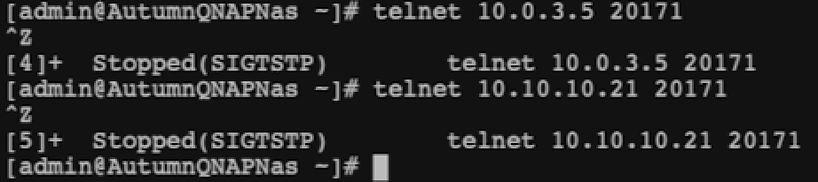

通过curl命令测试发现也是通的。那问题就出在container station

```bash
export http_proxy="http://10.10.10.21:20171"
export https_proxy="http://10.10.10.21:20171"
curl https://twitter.com
```

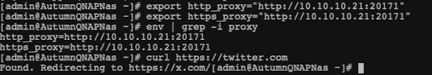

经历了几次界面重启和命令重启


最后终于成功

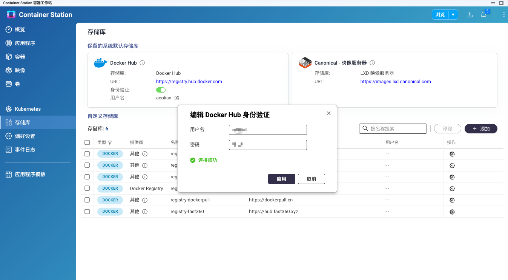

## Docker安装Clash Meta

[MetaCubeX](https://github.com/MetaCubeX/mihomo/tree/Meta)

/share/Container/clash/

├── config.yaml    # Clash 配置文件

└── ui/        # 可选：Yacd 面板

### **config.yaml** 

```yaml
mixed-port: 7890
socks-port: 7891
allow-lan: true
bind-address: 0.0.0.0
mode: rule
log-level: info
external-controller: 0.0.0.0:9090

dns:
  enable: true
  listen: 0.0.0.0:1053
  ipv6: false
  enhanced-mode: fake-ip
  nameservers:
    - 1.1.1.1
    - 8.8.8.8
    - tls://dns.google

proxies:
  - name: "Trojan-HK"
    type: trojan
    server: hk.example.com
    port: 443
    password: your_password_1
    sni: hk.example.com
    skip-cert-verify: false
    udp: true

  - name: "Trojan-JP"
    type: trojan
    server: jp.example.net
    port: 443
    password: your_password_2
    sni: jp.example.net
    skip-cert-verify: false
    udp: true

proxy-groups:
  - name: "🚀 节点选择"
    type: select
    proxies:
      - "Trojan-HK"
      - "Trojan-JP"
      - DIRECT

rules:
  - DOMAIN-SUFFIX,google.com,🚀 节点选择
  - DOMAIN-SUFFIX,github.com,🚀 节点选择
  - DOMAIN-SUFFIX,youtube.com,🚀 节点选择
  - GEOIP,CN,DIRECT
  - MATCH,🚀 节点选择
```

### 启动 Clash Meta 容器

```bash
docker run -d \
  --name clash \
  -v /share/Container/clash:/root/.config/mihomo \
  -p 17890:7890 \
  -p 17891:7891 \
  -p 19090:9090 \
  -p 11053:1053/udp \
  --restart unless-stopped \
  metacubex/mihomo:v1.19.7
```

> 若之前已运行 clash 容器，先执行：
>
> docker stop clash && docker rm clash

### 使用 curl 验证代理可用性

```bash
#HTTP 测试（NAS 本机）
curl -x http://127.0.0.1:17890 https://api.ipify.org
#SOCKS5 测试（NAS 本机）
curl --socks5 127.0.0.1:17891 https://httpbin.org/ip
#远程设备测试（LAN 设备）
curl -x http://<NAS内网IP>:17890 https://ip.sb
```

> 若返回 IP 为代理出口（非中国 IP），即配置成功。

如果显示Failed to connect to 127.0.0.1 port 17890 after 0 ms: Couldn't connect to server

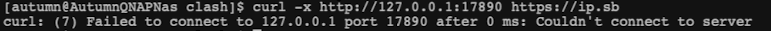

```bash
#查看日志
docker logs clash
```

查看日志，把日志放到chatgpt中检查是否有问题。

```bash
#查看挂载后的实际文件内容
docker exec -it clash cat /root/.config/clash/config.yaml
```

检查挂载后的实际文件内容

```bash
#查看容器内监听的端口及host是否为0.0.0.0
docker exec -it clash netstat -tulnp | grep 7890
```

检查服务是否重新监听在0.0.0.0，发现无论怎么重启都是监听127.0.0.1，说明bind-address: 0.0.0.0没有生效

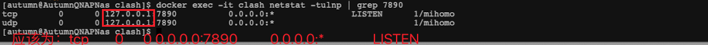

经过检测容器中的目录不是/root/.config/clash，而是/root/.config/mihomo，删除重新安装即可解决

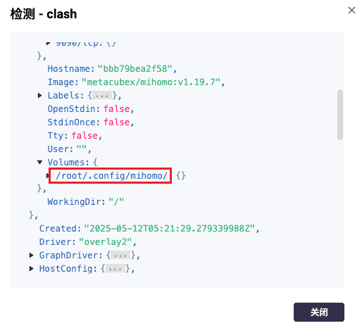

### 🎁 可选：部署 Yacd 控制面板

可以手动下载 [Yacd UI](https://github.com/haishanh/yacd/releases) 文件到 /share/Container/clash/ui/，tar -xvf yacd.tar.xz --strip-components=1解压发现可以访问。不下载也可以，会自动下载METACUBE（XD）

/share/Container/clash/

├── config.yaml       # 主配置

├── ui/           # Web UI 静态文件目录，ui下面要有**index.html**

│  ├── index.html

│  ├── static/

│  └── ...

```bash
vi /share/Container/clash/config.yaml
#allow-lan: true后面添加如下内容
external-ui: dashboard
secret: "Password"
#默认把 / 映射到 UI，而不是 API
external-ui-name: ""

#重启,自动下载到dashboard
docker restart clash
```

访问面板：http://<NAS-IP>:19090/ui

自动下载的METACUBE UI版本

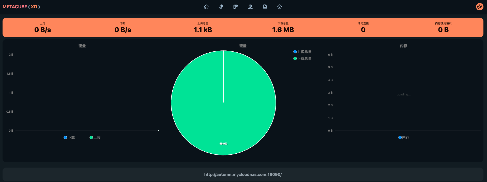

手动配置的Yacd版本

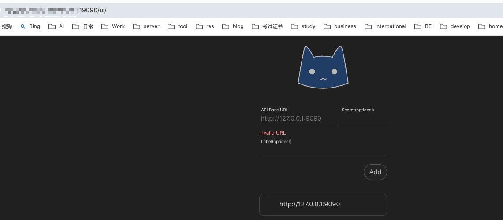

### 报错：can't initial GeoIP: can't download MMDB

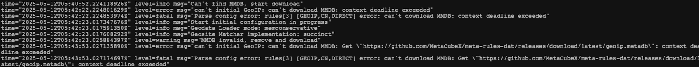

手动下载 Country.mmdb 并挂载到容器中，避免它在启动时尝试联网去拉：

geoid.metadb: 

Country.mmdb: https://github.moeyy.xyz/https://github.com/Dreamacro/maxmind-geoip/raw/release/Country.mmdb

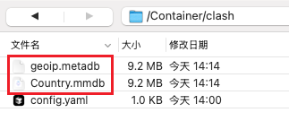

