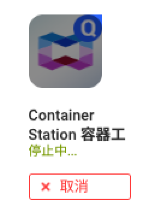

## Docker直接安装V2raya

官网： https://v2raya.org

```bash
#获取最新版镜像
docker pull mzz2017/v2raya
#停止现有版本容器并移除容器
docker container stop v2raya
docker container rm v2raya

#运行容器
docker run -d \
  --restart=always \
  --privileged \
  --network=host \
  --name v2raya \
  -e V2RAYA_LOG_FILE=/tmp/v2raya.log \
  -e V2RAYA_V2RAY_BIN=/usr/local/bin/v2ray \
  -e V2RAYA_NFTABLES_SUPPORT=off \
  -e IPTABLES_MODE=legacy \
  -v /lib/modules:/lib/modules:ro \
  -v /etc/resolv.conf:/etc/resolv.conf \
  -v /share/Container/v2raya:/etc/v2raya \
  mzz2017/v2raya

#查看状态
docker container stats v2raya
```

安装完之后端口为2017，通过http://IP:2017端口访问。

## Container Station安装V2rayA

### 新建容器

镜像为Docker Hub的“mzz2017/v2raya:latest”


### 配置容器

配置好网络和主机端口


### 确认测试


创建完成后复制端口转发


### 创建管理员账号密码

复制进去进入V2raya管理员创建界面，如果忘记密码可以使用重置密码命令

```bash
#v2raya命令重置密码
sudo v2raya --reset-password
```


### 创建节点并启动

登陆后创建节点-》连接节点-》启动。


启动后由粉红色变为蓝色表示成功。


### 配置代理

默认情况下 v2rayA 会通过核心开放 20170(socks5), 20171(http), 20172(带分流规则的http) 端口。

如果是需要为局域网中的其他机器提供代理，在设置中打开“局域网共享”，并检查防火墙开放情况。

#### 透明代理


这种方法是 v2rayA 推荐的方法。它相比于其他方法具有诸多优势，v2rayA 可以一键开启透明代理，为**几乎所有程序**提供代理服务。

在设置中选择透明代理的分流方式，以及实现方式，然后保存即可。

注意，如需选择 GFWList，需要下载对应的规则库，请点击右上角的更新以完成下载。

#### 系统代理

系统代理可为**主动支持代理的程序**提供代理服务。在不同的桌面环境中设置的位置不尽相同，请通过搜索引擎自行搜索。

#### SwitchyOmega

SwitchyOmega 等浏览器插件可为**浏览器**提供代理服务。具体方法请通过搜索引擎自行搜索。

## Container Station使用代理

编辑container-station的run-docker.sh脚本，添加代理

```bash
# 编辑脚本文件
vi /share/CACHEDEV1_DATA/.qpkg/container-station/script/run-docker.sh

# 在倒数第二行添加如下配置
# docker设置代理
export http_proxy="http://server:port"
export https_proxy="http://server:port"
export no_proxy= "localhost,127.0.0.0/8,192.168.0.0/16,172.16.0.0/12,10.0.0.0/8"

# 重启container station生效
/etc/init.d/container-station.sh restart
```


### 使用后依然无法访问docker hub

在docker中又添加了一个桥接模式的网络


测试这两个网络，发现端口都是通的。


通过curl命令测试发现也是通的。那问题就出在container station


经历了几次界面重启和命令重启



最后终于成功


