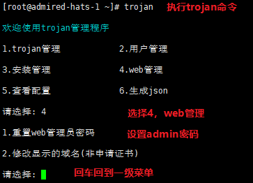
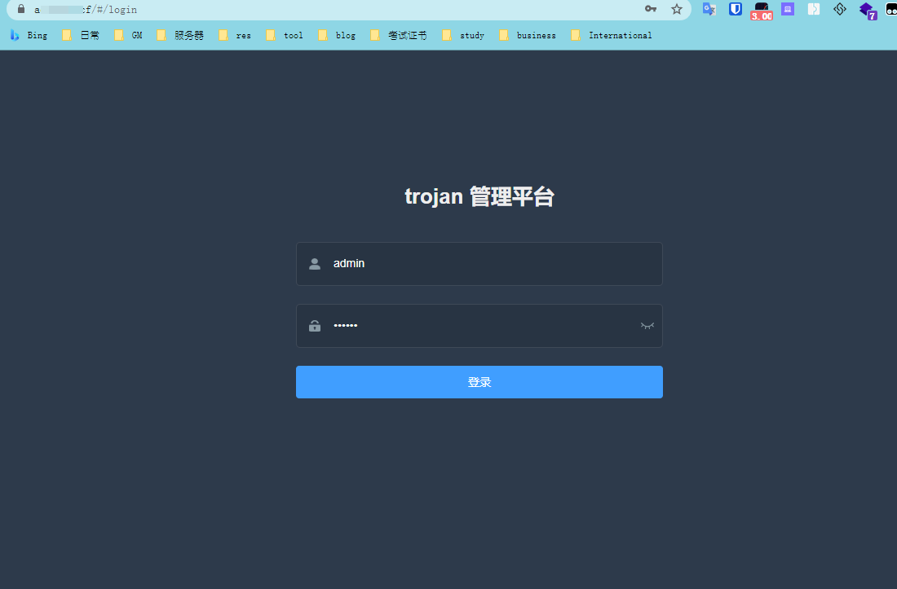
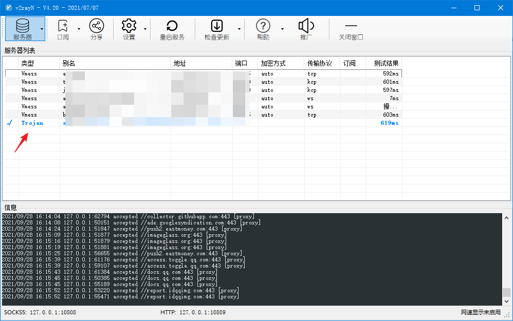
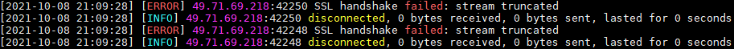
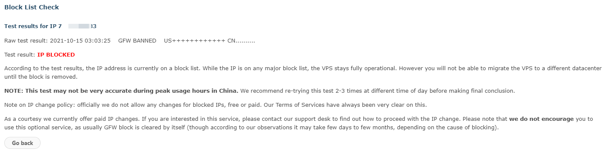
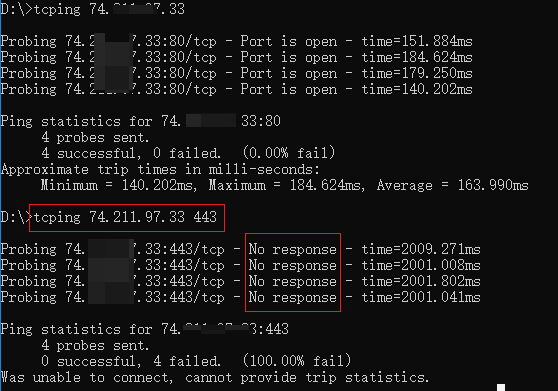

## 环境

系统：CentOS7

官网：https://github.com/Jrohy/trojan

## 一键安装

```shell
#安装/更新
source <(curl -sL https://git.io/trojan-install)

#卸载
source <(curl -sL https://git.io/trojan-install) --remove

##trojan管理
trojan
```
安装过程中输入域名，自动生成证书。



## Torjan Web端

https://域名

输入刚才设置的web的admin密码，进入后可以用web管理用户。



## 客户端

依然使用V2rayN，但是要使用高版本[V2rayN v4.20](https://github.com/2dust/v2rayN/releases)，V2rayN还需要单独下载内核[v2ray-core v4.42.2](https://github.com/v2fly/v2ray-core/releases)。



## 遇到的问题

### tcp干扰

用的好好的，突然不能翻墙了（Trojan的管理web依然可以访问登录、SSH可以直接连接），除此之外都正常（排除域名污染、IP被墙）。



再次测试，Trojan服务端无任何反应，服务端日志中没有打印任何东西，查看[搬瓦工GFW检测](https://kiwivm.64clouds.com/main-exec.php?mode=blacklistcheck)，发现IP Blocked（应该是TCP阻断/干扰，443端口可以访问web但是不能翻墙）。



下载[TCPing](https://elifulkerson.com/projects/tcping.php)，用tcping ip 443验证一下，果然不行。



#### 解决方法

Goflyway的WS+CDN模式 和 V2ray 的WS+CDN模式。

## GFW

###  **TCP封锁(阻断)** 

服务器 IP 被TCP封锁(阻断)后，依然可以正常的**向海外代理服务器发送数据**（客户端连接服务端），但是海外代理服务器上的代理服务端在**向你返回数据**的时候，肯定是要经过墙的，而墙发现发送者IP(代理服务器)在黑名单中，于是就会**阻断、拦截**，这样你的**客户端就收不到来自服务端的返回数据**了（SSR上表现为：超时或空连）。

而目前的代理软件基本都是使用 TCP 协议传输的，而TCP协议要传输数据，则先要进行握手环节，而握手自然要有来有回，所以当**墙对海外代理服务器回程TCP阻断**的时候，就会导致**代理客户端与服务端无法完成握手**，自然也无法使用代理了。