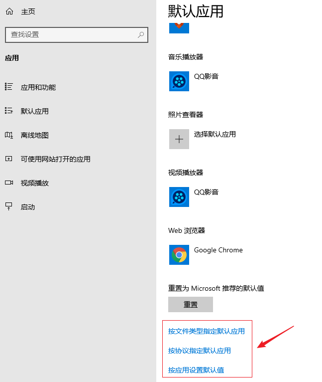
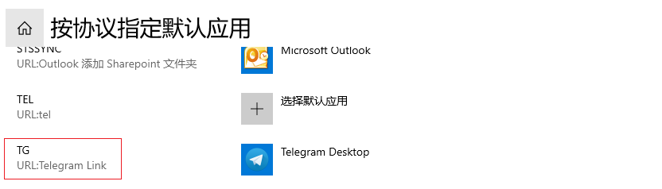
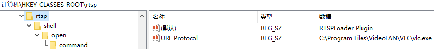
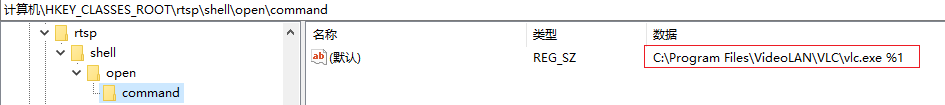
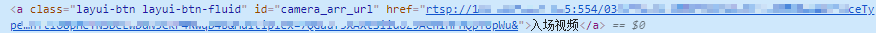

## 查看协议和文件类型的默认应用
Win + I -> 应用 -> 默认应用，按协议指定默认应用。

可以看到有些程序自定义协议在里面，并且可以设置打开此协议的程序，但是并没有发现可以新增协议。只能通过注册表来解决。


## 自定义浏览器协议
chrome浏览器用到了自定义浏览器协议这一标准。自定义浏览器协议允许在浏览器中使用protocol://url
的形式进行调用本地程序。包括在网页上拉起百度云网盘、或者拉起QQ等等，都属于自定义浏览器协议。

## 原理分析
在通过浏览器调用外部程序时，浏览器会在我们本地的注册表中查找协议所对应的注册表，并获取实际要调用的程序路径进行调用。
例如
```
rtsp://callback/?id=opaqueInternalAccesssObj
```
rtsp://为我们自定义的浏览器协议，后面的callback/?id=opaqueInternalAccessObj则为实际传入的参数

## 注册表解析
新建一个rtsp.reg文件，输入如下内容
```bash
Windows Registry Editor Version 5.00

[HKEY_CLASSES_ROOT\rtsp]
@="RTSPLoader Plugin"
"URL Protocol"="C:\\Program Files\\VideoLAN\\VLC\\vlc.exe"

[HKEY_CLASSES_ROOT\rtsp\shell]

[HKEY_CLASSES_ROOT\rtsp\shell\open]

[HKEY_CLASSES_ROOT\rtsp\shell\open\command]
@="C:\\Program Files\\VideoLAN\\VLC\\vlc.exe %1"
```
双击运行后在浏览器中输入rtsp://后会提示是否打开RTSPLoader Plugin(实则是打开Windows Shell)。

### 参数解析
1. [HKEY_CLASSES_ROOT] 是应用程序运行时必须的信息，[HKEY_CLASSES_ROOT\rtsp]表示在该注册表目录下生成了一个rtsp的应用程序运行时必须的信息。
@=为该应用程序默认名称，用来显示程序名称，不填则为exe名称。
URL Protocol=为该协议所要调用的程序地址。

2. [HKEY_CLASSES_ROOT\rtsp\shell]在rtsp\下生成shell目录。

3. [HKEY_CLASSES_ROOT\rtsp\shell\open]在rtsp\shell\下生成open目录。

4. [HKEY_CLASSES_ROOT\rtsp\shell\open\command]在rtsp\shell\open\下生成command目录，@=在command目录下新建一个默认值为协议调用程序的实际路径。%1代表rtsp://后面跟的参数。

## 注册表效果
输入地址： 计算机\HKEY_CLASSES_ROOT\rtsp，可以看到调用rtsp的程序名设置，和调用rtsp协议的默认程序(URL Protocol)



最终执行命令及参数



点击页面的rtsp超链接，提示用VLC media player打开。


